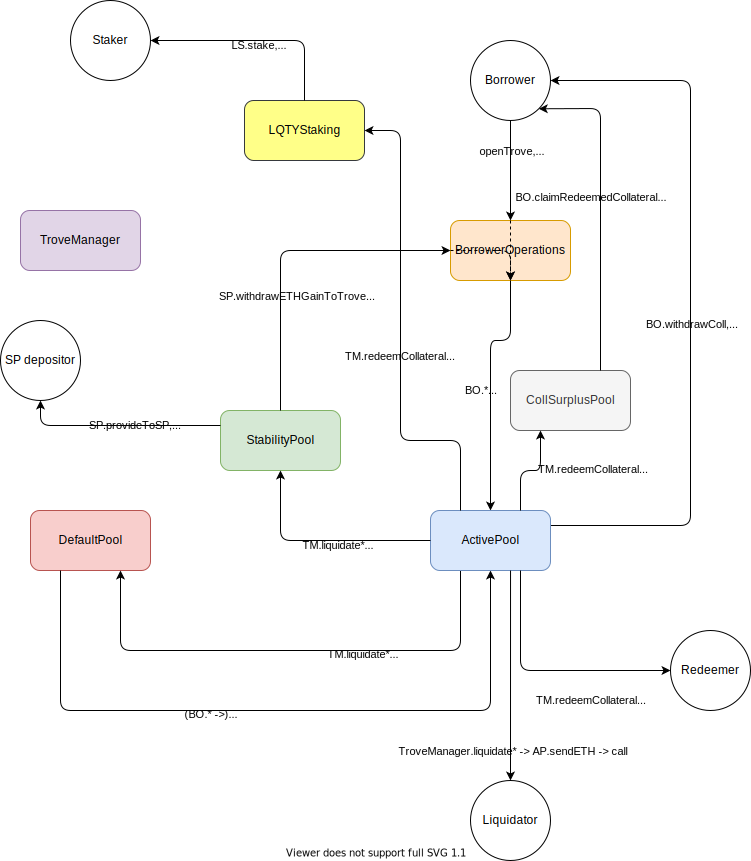
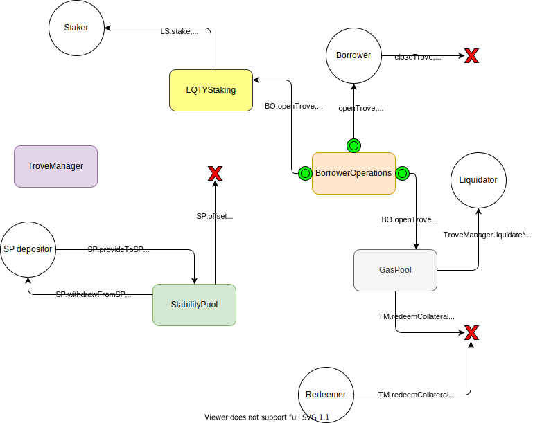
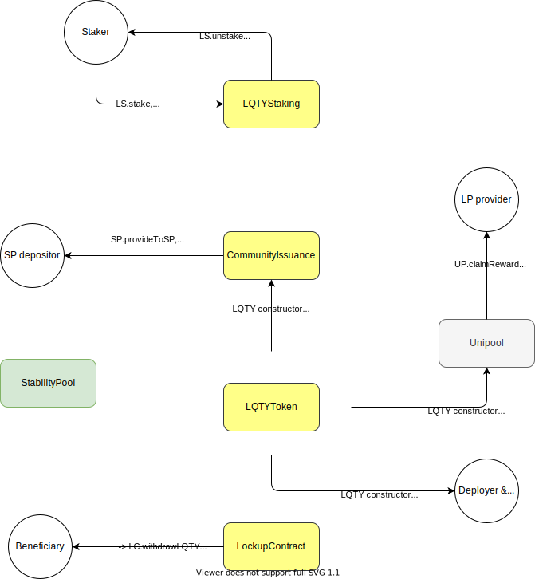

# Liquity: Decentralized Borrowing Protocol

 [](https://devui.liquity.org)  [](https://discord.gg/2up5U32) [](https://hub.docker.com/r/liquity/dev-frontend)


Liquity is a decentralized protocol that allows Ether holders to obtain maximum liquidity against
their collateral without paying interest. After locking up ETH as collateral in a smart contract and
creating an individual position called a "trove", the user can get instant liquidity by minting LUSD,
a USD-pegged stablecoin. Each trove is required to be collateralized at a minimum of 110%. Any
owner of LUSD can redeem their stablecoins for the underlying collateral at any time. The redemption
mechanism along with algorithmically adjusted fees guarantee a minimum stablecoin value of USD 1.

An unprecedented liquidation mechanism based on incentivized stability deposits and a redistribution
cycle from riskier to safer troves provides stability at a much lower collateral ratio than current
systems. Stability is maintained via economically-driven user interactions and arbitrage, rather
than by active governance or monetary interventions.

The protocol has built-in incentives that encourage both early adoption and the operation of
multiple front ends, enhancing decentralization.

## More information

Visit [liquity.org](https://www.liquity.org) to find out more and join the discussion.

## Liquity System Summary

- [Disclaimer](#disclaimer)
- [Liquity Overview](#liquity-overview)
- [Liquidation and the Stability Pool](#liquidation-and-the-stability-pool)
  - [Liquidation gas costs](#liquidation-gas-costs)
  - [Liquidation Logic](#liquidation-logic)
    - [Liquidations in Normal Mode: TCR >= 150%](#liquidations-in-normal-mode-tcr--150)
    - [Liquidations in Recovery Mode: TCR < 150%](#liquidations-in-recovery-mode-tcr--150)
- [Gains From Liquidations](#gains-from-liquidations)
- [LUSD Token Redemption](#lusd-token-redemption)
  - [Partial redemption](#partial-redemption)
  - [Full redemption](#full-redemption)
  - [Redemptions create a price floor](#redemptions-create-a-price-floor)
- [Recovery Mode](#recovery-mode)
- [Project Structure](#project-structure)
  - [Directories](#directories)
  - [Branches](#branches)
- [LQTY Token Architecture](#lqty-token-architecture)
  - [LQTY Lockup contracts and token vesting](#lqty-lockup-contracts-and-token-vesting)
  - [Lockup Implementation and admin transfer restriction](#lockup-implementation-and-admin-transfer-restriction)
  - [Launch sequence and vesting process](#launch-sequence-and-vesting-process)
    - [Deploy LQTY Contracts](#deploy-lqty-contracts)
    - [Deploy and fund Lockup Contracts](#deploy-and-fund-lockup-contracts)
    - [Deploy Liquity Core](#deploy-liquity-core)
    - [During one year lockup period](#during-one-year-lockup-period)
    - [Upon end of one year lockup period](#upon-end-of-one-year-lockup-period)
    - [Post-lockup period](#post-lockup-period)
- [Core System Architecture](#core-system-architecture)
  - [Core Smart Contracts](#core-smart-contracts)
  - [Data and Value Silo Contracts](#data-and-value-silo-contracts)
  - [Contract Interfaces](#contract-interfaces)
  - [PriceFeed and Oracle](#pricefeed-and-oracle)
  - [PriceFeed Logic](#pricefeed-logic)
  - [Testnet PriceFeed and PriceFeed tests](#testnet-pricefeed-and-pricefeed-tests)
  - [PriceFeed limitations and known issues](#pricefeed-limitations-and-known-issues)
  - [Keeping a sorted list of Troves ordered by ICR](#keeping-a-sorted-list-of-troves-ordered-by-icr)
  - [Flow of Ether in Liquity](#flow-of-ether-in-liquity)
  - [Flow of LUSD tokens in Liquity](#flow-of-lusd-tokens-in-liquity)
  - [Flow of LQTY Tokens in Liquity](#flow-of-lqty-tokens-in-liquity)
- [Expected User Behaviors](#expected-user-behaviors)
- [Contract Ownership and Function Permissions](#contract-ownership-and-function-permissions)
- [Deployment to a Development Blockchain](#deployment-to-a-development-blockchain)
- [Running Tests](#running-tests)
  - [Brownie Tests](#brownie-tests)
  - [OpenEthereum](#openethereum)
- [System Quantities - Units and Representation](#system-quantities---units-and-representation)
  - [Integer representations of decimals](#integer-representations-of-decimals)
- [Public Data](#public-data)
- [Public User-Facing Functions](#public-user-facing-functions)
  - [Borrower (Trove) Operations - `BorrowerOperations.sol`](#borrower-trove-operations---borroweroperationssol)
  - [TroveManager Functions - `TroveManager.sol`](#trovemanager-functions---trovemanagersol)
  - [Hint Helper Functions - `HintHelpers.sol`](#hint-helper-functions---hinthelperssol)
  - [Stability Pool Functions - `StabilityPool.sol`](#stability-pool-functions---stabilitypoolsol)
  - [LQTY Staking Functions  `LQTYStaking.sol`](#lqty-staking-functions--lqtystakingsol)
  - [Lockup Contract Factory `LockupContractFactory.sol`](#lockup-contract-factory-lockupcontractfactorysol)
  - [Lockup contract - `LockupContract.sol`](#lockup-contract---lockupcontractsol)
  - [LUSD token `LUSDToken.sol` and LQTY token `LQTYToken.sol`](#lusd-token-lusdtokensol-and-lqty-token-lqtytokensol)
- [Supplying Hints to Trove operations](#supplying-hints-to-trove-operations)
  - [Hints for `redeemCollateral`](#hints-for-redeemcollateral)
    - [First redemption hint](#first-redemption-hint)
    - [Partial redemption hints](#partial-redemption-hints)
- [Gas compensation](#gas-compensation)
  - [Gas compensation schedule](#gas-compensation-schedule)
  - [Liquidation](#liquidation)
  - [Gas compensation and redemptions](#gas-compensation-and-redemptions)
  - [Gas compensation helper functions](#gas-compensation-helper-functions)
- [The Stability Pool](#the-stability-pool)
  - [Mixed liquidations: offset and redistribution](#mixed-liquidations-offset-and-redistribution)
  - [Stability Pool deposit losses and ETH gains - implementation](#stability-pool-deposit-losses-and-eth-gains---implementation)
  - [Stability Pool example](#stability-pool-example)
  - [Stability Pool implementation](#stability-pool-implementation)
  - [How deposits and ETH gains are tracked](#how-deposits-and-eth-gains-are-tracked)
- [LQTY Issuance to Stability Providers](#lqty-issuance-to-stability-providers)
  - [LQTY Issuance schedule](#lqty-issuance-schedule)
  - [LQTY Issuance implementation](#lqty-issuance-implementation)
  - [Handling the front end LQTY gain](#handling-the-front-end-lqty-gain)
  - [LQTY reward events and payouts](#lqty-reward-events-and-payouts)
- [LQTY issuance to liquity providers](#lqty-issuance-to-liquity-providers)
- [Liquity System Fees](#liquity-system-fees)
  - [Redemption Fee](#redemption-fee)
  - [Issuance fee](#issuance-fee)
  - [Fee Schedule](#fee-schedule)
  - [Intuition behind fees](#intuition-behind-fees)
  - [Fee decay Implementation](#fee-decay-implementation)
  - [Staking LQTY and earning fees](#staking-lqty-and-earning-fees)
- [Redistributions and Corrected Stakes](#redistributions-and-corrected-stakes)
  - [Corrected Stake Solution](#corrected-stake-solution)
- [Math Proofs](#math-proofs)
- [Definitions](#definitions)
- [Development](#development)
  - [Prerequisites](#prerequisites)
    - [Making node-gyp work](#making-node-gyp-work)
  - [Clone & Install](#clone--install)
  - [Top-level scripts](#top-level-scripts)
    - [Run all tests](#run-all-tests)
    - [Deploy contracts to a testnet](#deploy-contracts-to-a-testnet)
    - [Start a local blockchain and deploy the contracts](#start-a-local-blockchain-and-deploy-the-contracts)
    - [Start dev-frontend in development mode](#start-dev-frontend-in-development-mode)
    - [Start dev-frontend in demo mode](#start-dev-frontend-in-demo-mode)
    - [Build dev-frontend for production](#build-dev-frontend-for-production)
  - [Configuring your custom frontend](#configuring-your-custom-dev-ui)
- [Running a frontend with Docker](#running-dev-ui-with-docker)
  - [Prerequisites](#prerequisites-1)
  - [Running with `docker`](#running-with-docker)
  - [Configuring a public frontend](#configuring-a-public-dev-ui)
    - [FRONTEND_TAG](#frontend_tag)
    - [INFURA_API_KEY](#infura_api_key)
  - [Setting a kickback rate](#setting-a-kickback-rate)
  - [Setting a kickback rate with Gnosis Safe](#setting-a-kickback-rate-with-gnosis-safe)
  - [Next steps for hosting a frontend](#next-steps-for-hosting-dev-ui)
    - [Example 1: using static website hosting](#example-1-using-static-website-hosting)
    - [Example 2: wrapping the frontend container in HTTPS](#example-2-wrapping-the-dev-ui-container-in-https)
- [Known Issues](#known-issues)
- [Disclaimer](#disclaimer)

## Liquity Overview

Liquity is a collateralized debt platform. Users can lock up Ether, and issue stablecoin tokens (LUSD) to their own Ethereum address, and subsequently transfer those tokens to any other Ethereum address. The individual collateralized debt positions are called Troves.

The stablecoin tokens are economically geared towards maintaining value of 1 LUSD = \$1 USD, due to the following properties:

1. The system is designed to always be over-collateralized - the dollar value of the locked Ether exceeds the dollar value of the issued stablecoins

2. The stablecoins are fully redeemable - users can always swap $x worth of LUSD for $x worth of ETH (minus fees), directly with the system.

3. The system algorithmically controls the generation of LUSD through a variable issuance fee.

After opening a Trove with some Ether, users may issue ("borrow") tokens such that the collateralization ratio of their Trove remains above 110%. A user with $1000 worth of ETH in a Trove can issue up to 909.09 LUSD.

The tokens are freely exchangeable - anyone with an Ethereum address can send or receive LUSD tokens, whether they have an open Trove or not. The tokens are burned upon repayment of a Trove's debt.

The Liquity system regularly updates the ETH:USD price via a decentralized data feed. When a Trove falls below a minimum collateralization ratio (MCR) of 110%, it is considered under-collateralized, and is vulnerable to liquidation.

## Liquidation and the Stability Pool

Liquity utilizes a two-step liquidation mechanism in the following order of priority: 

1. Offset under-collateralized Troves against the Stability Pool containing LUSD tokens

2. Redistribute under-collateralized Troves to other borrowers if the Stability Pool is emptied

Liquity primarily uses the LUSD tokens in its Stability Pool to absorb the under-collateralized debt, i.e. to repay the liquidated borrower's liability.

Any user may deposit LUSD tokens to the Stability Pool. This allows them to earn the collateral from the liquidated Trove. When a liquidation occurs, the liquidated debt is cancelled with the same amount of LUSD in the Pool (which is burned as a result), and the liquidated Ether is proportionally distributed to depositors.

Stability Pool depositors can expect to earn net gains from liquidations, as in most cases, the value of the liquidated Ether will be greater than the value of the cancelled debt (since a liquidated Trove will likely have an ICR just slightly below 110%).

If the liquidated debt is higher than the amount of LUSD in the Stability Pool, the system tries to cancel as much debt as possible with the tokens in the Stability Pool, and then redistributes the remaining liquidated collateral and debt across all active Troves.

Anyone may call the public `liquidateTroves()` function, which will check for under-collateralized Troves, and liquidate them. Alternatively they can call `batchLiquidateTroves()` with a custom list of trove addresses to attempt to liquidate.

### Liquidation gas costs

Currently, mass liquidations performed via the above functions cost 60-65k gas per trove. Thus the system can liquidate up to a maximum of 95-105 troves in a single transaction.

### Liquidation Logic

The precise behavior of liquidations depends on the ICR of the Trove being liquidated and global system conditions:  the total collateralization ratio (TCR) of the system, the size of the Stability Pool, etc.  

Here is the liquidation logic for a single Trove in Normal Mode and Recovery Mode.  `SP.LUSD` represents the LUSD in the Stability Pool.

#### Liquidations in Normal Mode: TCR >= 150%

| &nbsp;&nbsp;&nbsp;&nbsp;&nbsp;&nbsp;&nbsp;&nbsp;&nbsp;&nbsp;&nbsp;&nbsp;&nbsp;&nbsp;&nbsp;&nbsp;&nbsp;&nbsp;&nbsp;&nbsp;&nbsp;&nbsp;&nbsp;&nbsp;&nbsp;&nbsp;&nbsp;&nbsp;&nbsp;&nbsp;&nbsp;&nbsp;&nbsp;&nbsp;&nbsp;&nbsp;&nbsp;&nbsp;&nbsp;&nbsp;&nbsp;&nbsp;&nbsp;&nbsp;&nbsp;&nbsp;&nbsp;&nbsp;&nbsp;&nbsp;&nbsp;&nbsp;&nbsp;&nbsp;&nbsp;&nbsp;&nbsp;&nbsp;&nbsp;&nbsp;Condition                      | Liquidation behavior                                                                                                                                                                                                                                                                                                |
|----------------------------------|---------------------------------------------------------------------------------------------------------------------------------------------------------------------------------------------------------------------------------------------------------------------------------------------------------------------|
| ICR < MCR & SP.LUSD >= trove.debt | LUSD in the StabilityPool equal to the Trove's debt is offset with the Trove's debt. The Trove's ETH collateral is shared between depositors.                                                                                                                                                                       |
| ICR < MCR & SP.LUSD < trove.debt | The total StabilityPool LUSD is offset with an equal amount of debt from the Trove.  A fraction of the Trove's collateral (equal to the ratio of its offset debt to its entire debt) is shared between depositors. The remaining debt and collateral (minus ETH gas compensation) is redistributed to active Troves |
| ICR < MCR & SP.LUSD = 0          | Redistribute all debt and collateral (minus ETH gas compensation) to active Troves.                                                                                                                                                                                                                                 |
| ICR  >= MCR                      | Do nothing.                                                                                                                                                                                                                                                                                                         |
#### Liquidations in Recovery Mode: TCR < 150%

| &nbsp;&nbsp;&nbsp;&nbsp;&nbsp;&nbsp;&nbsp;&nbsp;&nbsp;&nbsp;&nbsp;&nbsp;&nbsp;&nbsp;&nbsp;&nbsp;&nbsp;&nbsp;&nbsp;&nbsp;&nbsp;&nbsp;&nbsp;&nbsp;&nbsp;&nbsp;&nbsp;&nbsp;&nbsp;&nbsp;&nbsp;&nbsp;&nbsp;&nbsp;&nbsp;&nbsp;&nbsp;&nbsp;&nbsp;&nbsp;&nbsp;&nbsp;&nbsp;&nbsp;&nbsp;&nbsp;&nbsp;&nbsp;&nbsp;&nbsp;&nbsp;&nbsp;&nbsp;&nbsp;&nbsp;&nbsp;&nbsp;&nbsp;&nbsp;&nbsp;Condition                                | Liquidation behavior                                                                                                                                                                                                                                                                                                                                                                                         |
|------------------------------------------|--------------------------------------------------------------------------------------------------------------------------------------------------------------------------------------------------------------------------------------------------------------------------------------------------------------------------------------------------------------------------------------------------------------|
| ICR <=100%                               | Redistribute all debt and collateral (minus ETH gas compensation) to active Troves.                                                                                                                                                                                                                                                                                                                          |
| 100% < ICR < MCR & SP.LUSD > trove.debt  | LUSD in the StabilityPool equal to the Trove's debt is offset with the Trove's debt. The Trove's ETH collateral (minus ETH gas compensation) is shared between depsitors.                                                                                                                                                                                                                                    |
| 100% < ICR < MCR & SP.LUSD < trove.debt  | The total StabilityPool LUSD is offset with an equal amount of debt from the Trove.  A fraction of the Trove's collateral (equal to the ratio of its offset debt to its entire debt) is shared between depositors. The remaining debt and collateral (minus ETH gas compensation) is redistributed to active troves                                                                                          |
| MCR <= ICR < TCR & SP.LUSD >= trove.debt  |  The Pool LUSD is offset with an equal amount of debt from the Trove. A fraction of ETH collateral with dollar value equal to `1.1 * debt` is shared between depositors. Nothing is redistributed to other active Troves. Since it's ICR was > 1.1, the Trove has a collateral remainder, which is sent to the `CollSurplusPool` and is claimable by the borrower. The Trove is closed. |
| MCR <= ICR < TCR & SP.LUSD  < trove.debt | Do nothing.                                                                                                                                                                                                                                                                                                                                                                                                  |
| ICR >= TCR                               | Do nothing.                                                                                                                                                                                                                                                                                                                                                                                                  |

## Gains From Liquidations

Stability Pool depositors gain Ether over time, as liquidated debt is cancelled with their deposit. When they withdraw all or part of their deposited tokens, or top up their deposit, the system sends them their accumulated ETH gains.

Similarly, a Trove's accumulated gains from liquidations are automatically applied to the Trove when the owner performs any operation - e.g. adding/withdrawing collateral, or issuing/repaying LUSD.

## LUSD Token Redemption

Any LUSD holder (whether or not they have an active Trove) may redeem their LUSD directly with the system. Their LUSD is exchanged for ETH, at face value: redeeming x LUSD tokens returns \$x worth of ETH (minus a [redemption fee](#redemption-fee)).

When LUSD is redeemed for ETH, the system cancels the LUSD with debt from Troves, and the ETH is drawn from their collateral.

In order to fulfill the redemption request, Troves are redeemed from in ascending order of their collateralization ratio.

A redemption sequence of `n` steps will **fully** redeem from up to `n-1` Troves, and, and **partially** redeems from up to 1 Trove, which is always the last Trove in the redemption sequence.

Redemptions are blocked when TCR < 110% (there is no need to restrict ICR < TCR). At that TCR redemptions would likely be unprofitable, as LUSD is probably trading above $1 if the system has crashed that badly, but it could be a way for an attacker with a lot of LUSD to lower the TCR even further.

Note that redemptions are disabled during the first 14 days of operation since deployment of the Liquity protocol to protect the monetary system in its infancy.

### Partial redemption

Most redemption transactions will include a partial redemption, since the amount redeemed is unlikely to perfectly match the total debt of a series of Troves.

The partially redeemed Trove is re-inserted into the sorted list of Troves, and remains active, with reduced collateral and debt.

### Full redemption

A Trove is defined as “fully redeemed from” when the redemption has caused (debt-200) of its debt to absorb (debt-200) LUSD. Then, its 200 LUSD Liquidation Reserve is cancelled with its remaining 200 debt: the Liquidation Reserve is burned from the gas address, and the 200 debt is zero’d.

Before closing, we must handle the Trove’s **collateral surplus**: that is, the excess ETH collateral remaining after redemption, due to its initial over-collateralization.

This collateral surplus is sent to the `CollSurplusPool`, and the borrower can reclaim it later. The Trove is then fully closed.

### Redemptions create a price floor

Economically, the redemption mechanism creates a hard price floor for LUSD, ensuring that the market price stays at or near to $1 USD. 

## Recovery Mode

Recovery Mode kicks in when the total collateralization ratio (TCR) of the system falls below 150%.

During Recovery Mode, liquidation conditions are relaxed, and the system blocks borrower transactions that would further decrease the TCR. New LUSD may only be issued by adjusting existing Troves in a way that improves their ICR, or by opening a new Trove with an ICR of >=150%. In general, if an existing Trove's adjustment reduces its ICR, the transaction is only executed if the resulting TCR is above 150%

Recovery Mode is structured to incentivize borrowers to behave in ways that promptly raise the TCR back above 150%, and to incentivize LUSD holders to replenish the Stability Pool.

Economically, Recovery Mode is designed to encourage collateral top-ups and debt repayments, and also itself acts as a self-negating deterrent: the possibility of it occurring actually guides the system away from ever reaching it.

## Project Structure

### Directories

- `packages/dev-frontend/` - Liquity Developer UI: a fully functional React app used for interfacing with the smart contracts during development
- `packages/fuzzer/` - A very simple, purpose-built tool based on Liquity middleware for randomly interacting with the system
- `packages/lib-base/` - Common interfaces and classes shared by the other `lib-` packages
- `packages/lib-ethers/` - [Ethers](https://github.com/ethers-io/ethers.js/)-based middleware that can read Liquity state and send transactions
- `packages/lib-react/` - Components and hooks that React-based apps can use to view Liquity contract state
- `packages/lib-subgraph/` - [Apollo Client](https://github.com/apollographql/apollo-client)-based middleware backed by the Liquity subgraph that can read Liquity state
- `packages/providers/` - Subclassed Ethers providers used by the frontend
- `packages/subgraph/` - [Subgraph](https://thegraph.com) for querying Liquity state as well as historical data like transaction history
- `packages/contracts/` - The backend development folder, contains the Hardhat project, contracts and tests
- `packages/contracts/contracts/` - The core back end smart contracts written in Solidity
- `packages/contracts/test/` - JS test suite for the system. Tests run in Mocha/Chai
- `packages/contracts/tests/` - Python test suite for the system. Tests run in Brownie
- `packages/contracts/gasTest/` - Non-assertive tests that return gas costs for Liquity operations under various scenarios
- `packages/contracts/fuzzTests/` - Echidna tests, and naive "random operation" tests 
- `packages/contracts/migrations/` - contains Hardhat script for deploying the smart contracts to the blockchain
- `packages/contracts/utils/` - external Hardhat and node scripts - deployment helpers, gas calculators, etc
- `packages/contracts/mathProofs/` - core mathematical proofs of Liquity properties, and a derivation of the scalable Stability Pool staking formula

Backend development is done in the Hardhat framework, and allows Liquity to be deployed on the Hardhat EVM network for fast compilation and test execution.

### Branches

As of 18/01/2021, the current working branch is `main`. `master` is out of date.

## LQTY Token Architecture

The Liquity system incorporates a secondary token, LQTY. This token entitles the holder to a share of the system revenue generated by redemption fees and  issuance fees.

To earn a share of system fees, the LQTY holder must stake their LQTY in a staking contract.

Liquity also issues LQTY to Stability Providers, in a continous time-based manner.

The LQTY contracts consist of:

`LQTYStaking.sol` - the staking contract, containing stake and unstake functionality for LQTY holders. This contract receives ETH fees from redemptions, and LUSD fees from new debt issuance.

`CommunityIssuance.sol` - This contract handles the issuance of LQTY tokens to Stability Providers as a function of time. It is controlled by the `StabilityPool`. Upon system launch, the `CommunityIssuance` automatically receives 32 million LQTY - the “community issuance” supply. The contract steadily issues these LQTY tokens to the Stability Providers over time.

`LQTYToken.sol` - This is the LQTY ERC20 contract. It has a hard cap supply of 100 million, and during the first year, restricts transfers from the Liquity admin address, a regular Ethereum address controlled by the project company Liquity AG. **Note that the Liquity admin address has no extra privileges and does not retain any control over the Liquity protocol once deployed.**

### LQTY Lockup contracts and token vesting

Some LQTY is reserved for team members and partners, and is locked up for one year upon system launch. Additionally, some team members receive LQTY vested on a monthly basis, which during the first year, is transferred directly to their lockup contract.

In the first year after launch:

- All team members and partners are unable to access their locked up LQTY tokens

- The Liquity admin address may transfer tokens **only to verified lockup contracts with an unlock date at least one year after system deployment**

Also, separate LQTY allocations are made at deployent to an EOA that will hold an amount of LQTY for bug bounties/hackathons and to a Uniswap LP reward contract. Aside from these allocations, the only LQTY made freely available in this first year is the LQTY that is publically issued to Stability Providers via the `CommunityIssuance` contract.

### Lockup Implementation and admin transfer restriction

A `LockupContractFactory` is used to deploy `LockupContracts` in the first year. During the first year, the `LQTYToken` checks that any transfer from the Liquity admin address is to a valid `LockupContract` that is registered in and was deployed through the `LockupContractFactory`.

### Launch sequence and vesting process

#### Deploy LQTY Contracts
1. Liquity admin deploys `LockupContractFactory`
2. Liquity admin deploys `CommunityIssuance`
3. Liquity admin deploys `LQTYStaking` 
4. Liquity admin creates a Pool in Uniswap for LUSD/ETH and deploys `Unipool` (LP rewards contract), which knows the address of the Pool
5. Liquity admin deploys `LQTYToken`, which upon deployment:
- Stores the `CommunityIssuance` and `LockupContractFactory` addresses
- Mints LQTY tokens to `CommunityIssuance`, the Liquity admin address, the `Unipool` LP rewards address, and the bug bounty address
6. Liquity admin sets `LQTYToken` address in `LockupContractFactory`, `CommunityIssuance`, `LQTYStaking`, and `Unipool`

#### Deploy and fund Lockup Contracts
7. Liquity admin tells `LockupContractFactory` to deploy a `LockupContract` for each beneficiary, with an `unlockTime` set to exactly one year after system deployment
8. Liquity admin transfers LQTY to each `LockupContract`, according to their entitlement

#### Deploy Liquity Core
9. Liquity admin deploys the Liquity core system
10. Liquity admin connects Liquity core system internally (with setters)
11. Liquity admin connects `LQTYStaking` to Liquity core contracts and `LQTYToken`
13. Liquity admin connects `CommunityIssuance` to Liquity core contracts and `LQTYToken`

#### During one year lockup period
- Liquity admin periodically transfers newly vested tokens to team & partners’ `LockupContracts`, as per their vesting schedules
- Liquity admin may only transfer LQTY to `LockupContracts`
- Anyone may deploy new `LockupContracts` via the Factory, setting any `unlockTime` that is >= 1 year from system deployment

#### Upon end of one year lockup period
- All beneficiaries may withdraw their entire entitlements
- Liquity admin address restriction on LQTY transfers is automatically lifted, and Liquity admin may now transfer LQTY to any address
- Anyone may deploy new `LockupContracts` via the Factory, setting any `unlockTime` in the future

#### Post-lockup period
- Liquity admin periodically transfers newly vested tokens to team & partners, directly to their individual addresses, or to a fresh lockup contract if required.

_NOTE: In the final architecture, a multi-sig contract will be used to move LQTY Tokens, rather than the single Liquity admin EOA. It will be deployed at the start of the sequence, and have its address recorded in  `LQTYToken` in step 4, and receive LQTY tokens. It will be used to move LQTY in step 7, and during & after the lockup period. The Liquity admin EOA will only be used for deployment of contracts in steps 1-4 and 9._

_The current code does not utilize a multi-sig. It implements the launch architecture outlined above._

_Additionally, a LP staking contract will receive the initial LP staking reward allowance, rather than an EOA. It will be used to hold and issue LQTY to users who stake LP tokens that correspond to certain pools on DEXs._

## Core System Architecture

The core Liquity system consists of several smart contracts, which are deployable to the Ethereum blockchain.

All application logic and data is contained in these contracts - there is no need for a separate database or back end logic running on a web server. In effect, the Ethereum network is itself the Liquity back end. As such, all balances and contract data are public.

The system has no admin key or human governance. Once deployed, it is fully automated, decentralized and no user holds any special privileges in or control over the system.

The three main contracts - `BorrowerOperations.sol`, `TroveManager.sol` and `StabilityPool.sol` - hold the user-facing public functions, and contain most of the internal system logic. Together they control Trove state updates and movements of Ether and LUSD tokens around the system.

### Core Smart Contracts

`BorrowerOperations.sol` - contains the basic operations by which borrowers interact with their Trove: Trove creation, ETH top-up / withdrawal, stablecoin issuance and repayment. It also sends issuance fees to the `LQTYStaking` contract. BorrowerOperations functions call in to TroveManager, telling it to update Trove state, where necessary. BorrowerOperations functions also call in to the various Pools, telling them to move Ether/Tokens between Pools or between Pool <> user, where necessary.

`TroveManager.sol` - contains functionality for liquidations and redemptions. It sends redemption fees to the `LQTYStaking` contract. Also contains the state of each Trove - i.e. a record of the Trove’s collateral and debt. TroveManager does not hold value (i.e. Ether / other tokens). TroveManager functions call in to the various Pools to tell them to move Ether/tokens between Pools, where necessary.

`LiquityBase.sol` - Both TroveManager and BorrowerOperations inherit from the parent contract LiquityBase, which contains global constants and some common functions.

`StabilityPool.sol` - contains functionality for Stability Pool operations: making deposits, and withdrawing compounded deposits and accumulated ETH and LQTY gains. Holds the LUSD Stability Pool deposits, and the ETH gains for depositors, from liquidations.

`LUSDToken.sol` - the stablecoin token contract, which implements the ERC20 fungible token standard in conjunction with EIP-2612 and a mechanism that blocks (accidental) transfers to addresses like the StabilityPool and address(0) that are not supposed to receive funds through direct transfers. The contract mints, burns and transfers LUSD tokens.

`SortedTroves.sol` - a doubly linked list that stores addresses of Trove owners, sorted by their individual collateralization ratio (ICR). It inserts and re-inserts Troves at the correct position, based on their ICR.

`PriceFeed.sol` - Contains functionality for obtaining the current ETH:USD price, which the system uses for calculating collateralization ratios.

`HintHelpers.sol` - Helper contract, containing the read-only functionality for calculation of accurate hints to be supplied to borrower operations and redemptions.

### Data and Value Silo Contracts

Along with `StabilityPool.sol`, these contracts hold Ether and/or tokens for their respective parts of the system, and contain minimal logic:

`ActivePool.sol` - holds the total Ether balance and records the total stablecoin debt of the active Troves.

`DefaultPool.sol` - holds the total Ether balance and records the total stablecoin debt of the liquidated Troves that are pending redistribution to active Troves. If a Trove has pending ether/debt “rewards” in the DefaultPool, then they will be applied to the Trove when it next undergoes a borrower operation, a redemption, or a liquidation.

`CollSurplusPool.sol` - holds the ETH surplus from Troves that have been fully redeemed from as well as from Troves with an ICR > MCR that were liquidated in Recovery Mode. Sends the surplus back to the owning borrower, when told to do so by `BorrowerOperations.sol`.

`GasPool.sol` - holds the total LUSD liquidation reserves. LUSD is moved into the `GasPool` when a Trove is opened, and moved out when a Trove is liquidated or closed.

### Contract Interfaces

`ITroveManager.sol`, `IPool.sol` etc. These provide specification for a contract’s functions, without implementation. They are similar to interfaces in Java or C#.

### PriceFeed and Oracle

Liquity functions that require the most current ETH:USD price data fetch the price dynamically, as needed, via the core `PriceFeed.sol` contract using the Chainlink ETH:USD reference contract as its primary and Tellor's ETH:USD price feed as its secondary (fallback) data source. PriceFeed is stateful, i.e. it records the last good price that may come from either of the two sources based on the contract's current state.

The fallback logic distinguishes 3 different failure modes for Chainlink and 2 failure modes for Tellor:

- `Frozen` (for both oracles): last price update more than 4 hours ago
- `Broken` (for both oracles): response call reverted, invalid timeStamp that is either 0 or in the future, or reported price is non-positive (Chainlink) or zero (Tellor). Chainlink is considered broken if either the response for the latest round _or_ the response for the round before the latest fails one of these conditions.
- `PriceChangeAboveMax` (Chainlink only): higher than 50% deviation between two consecutive price updates

There is also a return condition `bothOraclesLiveAndUnbrokenAndSimilarPrice` which is a function returning true if both oracles are live and not broken, and the percentual difference between the two reported prices is below 5%.

The current `PriceFeed.sol` contract has an external `fetchPrice()` function that is called by core Liquity functions which require a current ETH:USD price.  `fetchPrice()` calls each oracle's proxy, asserts on the responses, and converts returned prices to 18 digits.

### PriceFeed Logic

The PriceFeed contract fetches the current price and previous price from Chainlink and changes its state (called `Status`) based on certain conditions.

**Initial PriceFeed state:** `chainlinkWorking`. The initial system state that is maintained as long as Chainlink is working properly, i.e. neither broken nor frozen nor exceeding the maximum price change threshold between two consecutive rounds. PriceFeed then obeys the logic found in this table:

  https://docs.google.com/spreadsheets/d/18fdtTUoqgmsK3Mb6LBO-6na0oK-Y9LWBqnPCJRp5Hsg/edit?usp=sharing


### Testnet PriceFeed and PriceFeed tests

The `PriceFeedTestnet.sol` is a mock PriceFeed for testnet and general back end testing purposes, with no oracle connection. It contains a manual price setter, `setPrice()`, and a getter, `getPrice()`, which returns the latest stored price.

The mainnet PriceFeed is tested in `test/PriceFeedTest.js`, using a mock Chainlink aggregator and a mock TellorMaster contract.

### PriceFeed limitations and known issues

The purpose of the PriceFeed is to be at least as good as an immutable PriceFeed that relies purely on Chainlink, while also having some resilience in case of Chainlink failure / timeout, and chance of recovery.

The PriceFeed logic consists of automatic on-chain decision-making for obtaining fallback price data from Tellor, and if possible, for returning to Chainlink if/when it recovers.

The PriceFeed logic is complex, and although we would prefer simplicity, it does allow the system a chance of switching to an accurate price source in case of a Chainlink failure or timeout, and also the possibility of returning to an honest Chainlink price after it has failed and recovered.

We believe the benefit of the fallback logic is worth the complexity, given that our system is entirely immutable - if we had no fallback logic and Chainlink were to be hacked or permanently fail, Liquity would become permanently unusable anyway.


**Chainlink Decimals**: the `PriceFeed` checks for and uses the latest `decimals` value reported by the Chainlink aggregator in order to calculate the Chainlink price at 18-digit precision, as needed by Liquity.  `PriceFeed` does not assume a value for decimals and can handle the case where Chainlink change their decimal value. 

However, the check `chainlinkIsBroken` uses both the current response from the latest round and the response previous round. Since `decimals` is not attached to round data, Liquity has no way of knowing whether decimals has changed between the current round and the previous round, so we assume it is the same. Liquity assumes the current return value of decimals() applies to both current round `i` and previous round `i-1`. 

This means that a decimal change that coincides with a Liquity price fetch could cause Liquity to assert that the Chainlink price has deviated too much, and fall back to Tellor. There is nothing we can do about this. We hope/expect Chainlink to never change their `decimals()` return value (currently 8), and if a hack/technical error causes Chainlink's decimals to change, Liquity may fall back to Tellor.

To summarize the Chainlink decimals issue: 
- Liquity can handle the case where Chainlink decimals changes across _two consecutive rounds `i` and `i-1` which are not used in the same Liquity price fetch_
- If Liquity fetches the price at round `i`, it will not know if Chainlink decimals changed across round `i-1` to round `i`, and the consequent price scaling distortion may cause Liquity to fall back to Tellor
- Liquity will always calculate the correct current price at 18-digit precision assuming the current return value of `decimals()` is correct (i.e. is the value used by the nodes).

**Tellor Decimals**: Tellor uses 6 decimal precision for their ETHUSD price as determined by a social consensus of Tellor miners/data providers, and shown on Tellor's price feed page. Their decimals value is not offered in their on-chain contracts.  We rely on the continued social consensus around 6 decimals for their ETHUSD price feed. Tellor have informed us that if there was demand for an ETHUSD price at different precision, they would simply create a new `requestId`, and make no attempt to alter the social consensus around the precision of the current ETHUSD `requestId` (1) used by Liquity.


### Keeping a sorted list of Troves ordered by ICR

Liquity relies on a particular data structure: a sorted doubly-linked list of Troves that remains ordered by individual collateralization ratio (ICR), i.e. the amount of collateral (in USD) divided by the amount of debt (in LUSD).

This ordered list is critical for gas-efficient redemption sequences and for the `liquidateTroves` sequence, both of which target Troves in ascending order of ICR.

The sorted doubly-linked list is found in `SortedTroves.sol`. 

Nodes map to active Troves in the system - the ID property is the address of a trove owner. The list accepts positional hints for efficient O(1) insertion - please see the [hints](#supplying-hints-to-cdp-operations) section for more details.

ICRs are computed dynamically at runtime, and not stored on the node. This is because ICRs of active Troves change dynamically, when:

- The ETH:USD price varies, altering the USD of the collateral of every Trove
- A liquidation that redistributes collateral and debt to active Troves occurs

The list relies on the fact that a collateral and debt redistribution due to a liquidation preserves the ordering of all active Troves (though it does decrease the ICR of each active Trove above the MCR).

The fact that ordering is maintained as redistributions occur, is not immediately obvious: please see the [mathematical proof](https://github.com/liquity/dev/blob/main/papers) which shows that this holds in Liquity.

A node inserted based on current ICR will maintain the correct position, relative to its peers, as liquidation gains accumulate, as long as its raw collateral and debt have not changed.

Nodes also remain sorted as the ETH:USD price varies, since price fluctuations change the collateral value of each Trove by the same proportion.

Thus, nodes need only be re-inserted to the sorted list upon a Trove operation - when the owner adds or removes collateral or debt to their position.

### Flow of Ether in Liquity



Ether in the system lives in three Pools: the ActivePool, the DefaultPool and the StabilityPool. When an operation is made, Ether is transferred in one of three ways:

- From a user to a Pool
- From a Pool to a user
- From one Pool to another Pool

Ether is recorded on an _individual_ level, but stored in _aggregate_ in a Pool. An active Trove with collateral and debt has a struct in the TroveManager that stores its ether collateral value in a uint, but its actual Ether is in the balance of the ActivePool contract.

Likewise, the StabilityPool holds the total accumulated ETH gains from liquidations for all depositors.

**Borrower Operations**

| Function                     | ETH quantity                        | Path                                       |
|------------------------------|-------------------------------------|--------------------------------------------|
| openTrove                    | msg.value                           | msg.sender->BorrowerOperations->ActivePool |
| addColl                      | msg.value                           | msg.sender->BorrowerOperations->ActivePool |
| withdrawColl                 | _collWithdrawal parameter           | ActivePool->msg.sender                     |
| adjustTrove: adding ETH      | msg.value                           | msg.sender->BorrowerOperations->ActivePool |
| adjustTrove: withdrawing ETH | _collWithdrawal parameter           | ActivePool->msg.sender                     |
| closeTrove                   | All remaining                       | ActivePool->msg.sender                     |
| claimCollateral              | CollSurplusPool.balance[msg.sender] | CollSurplusPool->msg.sender                |

**Trove Manager**

| Function                                | ETH quantity                           | Path                          |
|-----------------------------------------|----------------------------------------|-------------------------------|
| liquidate (offset)                      | collateral to be offset                | ActivePool->StabilityPool     |
| liquidate (redistribution)              | collateral to be redistributed         | ActivePool->DefaultPool       |
| liquidateTroves (offset)                | collateral to be offset                | ActivePool->StabilityPool     |
| liquidateTroves (redistribution)        | collateral to be redistributed         | ActivePool->DefaultPool       |
| batchLiquidateTroves (offset)           | collateral to be offset                | ActivePool->StabilityPool     |
| batchLiquidateTroves (redistribution).  | collateral to be redistributed         | ActivePool->DefaultPool       |
| redeemCollateral                        | collateral to be swapped with redeemer | ActivePool->msg.sender        |
| redeemCollateral                        | redemption fee                         | ActivePool->LQTYStaking       |
| redeemCollateral                        | trove's collateral surplus             | ActivePool->CollSurplusPool |

**Stability Pool**

| Function               | ETH quantity                     | Path                                              |
|------------------------|----------------------------------|---------------------------------------------------|
| provideToSP            | depositor's accumulated ETH gain | StabilityPool -> msg.sender                       |
| withdrawFromSP         | depositor's accumulated ETH gain | StabilityPool -> msg.sender                       |
| withdrawETHGainToTrove | depositor's accumulated ETH gain | StabilityPool -> BorrowerOperations -> ActivePool |

**LQTY Staking**

| Function    | ETH quantity                                   | Path                     |
|-------------|------------------------------------------------|--------------------------|
| stake       | staker's accumulated ETH gain from system fees | LQTYStaking ->msg.sender |
| unstake     | staker's accumulated ETH gain from system fees | LQTYStaking ->msg.sender |

### Flow of LUSD tokens in Liquity



When a user issues debt from their Trove, LUSD tokens are minted to their own address, and a debt is recorded on the Trove. Conversely, when they repay their Trove’s LUSD debt, LUSD is burned from their address, and the debt on their Trove is reduced.

Redemptions burn LUSD from the redeemer’s balance, and reduce the debt of the Trove redeemed against.

Liquidations that involve a Stability Pool offset burn tokens from the Stability Pool’s balance, and reduce the LUSD debt of the liquidated Trove.

The only time LUSD is transferred to/from a Liquity contract, is when a user deposits LUSD to, or withdraws LUSD from, the StabilityPool.

**Borrower Operations**

| Function                      | LUSD Quantity | ERC20 Operation                      |
|-------------------------------|---------------|--------------------------------------|
| openTrove                     | Drawn LUSD    | LUSD._mint(msg.sender, _LUSDAmount)  |
|                               | Issuance fee  | LUSD._mint(LQTYStaking,  LUSDFee)    |
| withdrawLUSD                  | Drawn LUSD    | LUSD._mint(msg.sender, _LUSDAmount)  |
|                               | Issuance fee  | LUSD._mint(LQTYStaking,  LUSDFee)    |
| repayLUSD                     | Repaid LUSD   | LUSD._burn(msg.sender, _LUSDAmount)  |
| adjustTrove: withdrawing LUSD | Drawn LUSD    | LUSD._mint(msg.sender, _LUSDAmount)  |
|                               | Issuance fee  | LUSD._mint(LQTYStaking,  LUSDFee)    |
| adjustTrove: repaying LUSD    | Repaid LUSD   | LUSD._burn(msg.sender, _LUSDAmount)  |
| closeTrove                    | Repaid LUSD   | LUSD._burn(msg.sender, _LUSDAmount) |

**Trove Manager**

| Function                 | LUSD Quantity            | ERC20 Operation                                  |
|--------------------------|--------------------------|--------------------------------------------------|
| liquidate (offset)       | LUSD to offset with debt | LUSD._burn(stabilityPoolAddress, _debtToOffset); |
| liquidateTroves (offset)   | LUSD to offset with debt | LUSD._burn(stabilityPoolAddress, _debtToOffset); |
| batchLiquidateTroves (offset) | LUSD to offset with debt | LUSD._burn(stabilityPoolAddress, _debtToOffset); |
| redeemCollateral         | LUSD to redeem           | LUSD._burn(msg.sender, _LUSD)                    |

**Stability Pool**

| Function       | LUSD Quantity    | ERC20 Operation                                             |
|----------------|------------------|-------------------------------------------------------------|
| provideToSP    | deposit / top-up | LUSD._transfer(msg.sender, stabilityPoolAddress, _amount);  |
| withdrawFromSP | withdrawal       | LUSD._transfer(stabilityPoolAddress, msg.sender, _amount);  |

**LQTY Staking**

| Function | LUSD Quantity                                   | ERC20 Operation                                           |
|----------|-------------------------------------------------|-----------------------------------------------------------|
| stake    | staker's accumulated LUSD gain from system fees | LUSD._transfer(LQTYStakingAddress, msg.sender, LUSDGain); |
| unstake  | staker's accumulated LUSD gain from system fees | LUSD._transfer(LQTYStakingAddress, msg.sender, LUSDGain); |

### Flow of LQTY Tokens in Liquity



Stability Providers and Frontend Operators receive LQTY gains according to their share of the total LUSD deposits, and the LQTY community issuance schedule.  Once obtained, LQTY can be staked and unstaked with the `LQTYStaking` contract.

**Stability Pool**

| Function               | LQTY Quantity       | ERC20 Operation                                                       |
|------------------------|---------------------|-----------------------------------------------------------------------|
| provideToSP            | depositor LQTY gain | LQTY._transfer(stabilityPoolAddress, msg.sender, depositorLQTYGain); |
|                        | front end LQTY gain | LQTY._transfer(stabilityPoolAddress, _frontEnd, frontEndLQTYGain);   |
| withdrawFromSP         | depositor LQTY gain | LQTY._transfer(stabilityPoolAddress, msg.sender, depositorLQTYGain); |
|                        | front end LQTY gain | LQTY._transfer(stabilityPoolAddress, _frontEnd, frontEndLQTYGain);   |
| withdrawETHGainToTrove | depositor LQTY gain | LQTY._transfer(stabilityPoolAddress, msg.sender, depositorLQTYGain); |
|                        | front end LQTY gain | LQTY._transfer(stabilityPoolAddress, _frontEnd, frontEndLQTYGain);   |

**LQTY Staking Contract**

| Function | LQTY Quantity                  | ERC20 Operation                                           |
|----------|--------------------------------|-----------------------------------------------------------|
| stake    | staker's LQTY deposit / top-up | LQTY._transfer(msg.sender, LQTYStakingAddress, _amount); |
| unstake  | staker's LQTY withdrawal       | LQTY._transfer(LQTYStakingAddress, msg.sender, _amount); |


## Expected User Behaviors

Generally, borrowers call functions that trigger Trove operations on their own Trove. Stability Pool users (who may or may not also be borrowers) call functions that trigger Stability Pool operations, such as depositing or withdrawing tokens to/from the Stability Pool.

Anyone may call the public liquidation functions, and attempt to liquidate one or several Troves.

LUSD token holders may also redeem their tokens, and swap an amount of tokens 1-for-1 in value (minus fees) with Ether.

LQTY token holders may stake their LQTY, to earn a share of the system fee revenue, in ETH and LUSD.

## Contract Ownership and Function Permissions

All the core smart contracts inherit from the OpenZeppelin `Ownable.sol` contract template. As such all contracts have a single owning address, which is the deploying address. The contract's ownership is renounced either upon deployment, or immediately after its address setter has been called, connecting it to the rest of the core Liquity system. 

Several public and external functions have modifiers such as `requireCallerIsTroveManager`, `requireCallerIsActivePool`, etc - ensuring they can only be called by the respective permitted contract.

## Deployment to a Development Blockchain

The Hardhat migrations script and deployment helpers in `utils/deploymentHelpers.js` deploy all contracts, and connect all contracts to their dependency contracts, by setting the necessary deployed addresses.

The project is deployed on the Ropsten testnet.

## Running Tests

Run all tests with `npx hardhat test`, or run a specific test with `npx hardhat test ./test/contractTest.js`

Tests are run against the Hardhat EVM.

### Brownie Tests
There are some special tests that are using Brownie framework.

To test, install brownie with:
```
python3 -m pip install --user pipx
python3 -m pipx ensurepath

pipx install eth-brownie
```

and add numpy with:
```
pipx inject eth-brownie numpy
```

Add OpenZeppelin package:
```
brownie pm install OpenZeppelin/openzeppelin-contracts@3.3.0
```

Run, from `packages/contracts/`:
```
brownie test -s
```

### OpenEthereum

Add the local node as a `live` network at `~/.brownie/network-config.yaml`:
```
(...)
      - name: Local Openethereum
        chainid: 17
        id: openethereum
        host: http://localhost:8545
```

Make sure state is cleaned up first:
```
rm -Rf build/deployments/*
```

Start Openthereum node from this repo’s root with:
```
yarn start-dev-chain:openethereum
```

Then, again from `packages/contracts/`, run it with:
```
brownie test -s --network openethereum
```

To stop the Openethereum node, you can do it with:
```
yarn stop-dev-chain
```

## System Quantities - Units and Representation

### Integer representations of decimals

Several ratios and the ETH:USD price are integer representations of decimals, to 18 digits of precision. For example:

| **uint representation of decimal** | **Number**    |
| ---------------------------------- | ------------- |
| 1100000000000000000                | 1.1           |
| 200000000000000000000              | 200           |
| 1000000000000000000                | 1             |
| 5432100000000000000                | 5.4321        |
| 34560000000                        | 0.00000003456 |
| 370000000000000000000              | 370           |
| 1                                  | 1e-18         |

etc.

## Public Data

All data structures with the ‘public’ visibility specifier are ‘gettable’, with getters automatically generated by the compiler. Simply call `TroveManager::MCR()` to get the MCR, etc.

## Public User-Facing Functions

### Borrower (Trove) Operations - `BorrowerOperations.sol`

`openTrove(uint _maxFeePercentage, uint _LUSDAmount, address _upperHint, address _lowerHint)`: payable function that creates a Trove for the caller with the requested debt, and the Ether received as collateral. Successful execution is conditional mainly on the resulting collateralization ratio which must exceed the minimum (110% in Normal Mode, 150% in Recovery Mode). In addition to the requested debt, extra debt is issued to pay the issuance fee, and cover the gas compensation. The borrower has to provide a `_maxFeePercentage` that he/she is willing to accept in case of a fee slippage, i.e. when a redemption transaction is processed first, driving up the issuance fee. 

`addColl(address _upperHint, address _lowerHint))`: payable function that adds the received Ether to the caller's active Trove.

`withdrawColl(uint _amount, address _upperHint, address _lowerHint)`: withdraws `_amount` of collateral from the caller’s Trove. Executes only if the user has an active Trove, the withdrawal would not pull the user’s Trove below the minimum collateralization ratio, and the resulting total collateralization ratio of the system is above 150%. 

`function withdrawLUSD(uint _maxFeePercentage, uint _LUSDAmount, address _upperHint, address _lowerHint)`: issues `_amount` of LUSD from the caller’s Trove to the caller. Executes only if the Trove's collateralization ratio would remain above the minimum, and the resulting total collateralization ratio is above 150%. The borrower has to provide a `_maxFeePercentage` that he/she is willing to accept in case of a fee slippage, i.e. when a redemption transaction is processed first, driving up the issuance fee.

`repayLUSD(uint _amount, address _upperHint, address _lowerHint)`: repay `_amount` of LUSD to the caller’s Trove, subject to leaving 50 debt in the Trove (which corresponds to the 50 LUSD gas compensation).

`_adjustTrove(address _borrower, uint _collWithdrawal, uint _debtChange, bool _isDebtIncrease, address _upperHint, address _lowerHint, uint _maxFeePercentage)`: enables a borrower to simultaneously change both their collateral and debt, subject to all the restrictions that apply to individual increases/decreases of each quantity with the following particularity: if the adjustment reduces the collateralization ratio of the Trove, the function only executes if the resulting total collateralization ratio is above 150%. The borrower has to provide a `_maxFeePercentage` that he/she is willing to accept in case of a fee slippage, i.e. when a redemption transaction is processed first, driving up the issuance fee. The parameter is ignored if the debt is not increased with the transaction.

`closeTrove()`: allows a borrower to repay all debt, withdraw all their collateral, and close their Trove. Requires the borrower have a LUSD balance sufficient to repay their trove's debt, excluding gas compensation - i.e. `(debt - 50)` LUSD.

`claimCollateral(address _user)`: when a borrower’s Trove has been fully redeemed from and closed, or liquidated in Recovery Mode with a collateralization ratio above 110%, this function allows the borrower to claim their ETH collateral surplus that remains in the system (collateral - debt upon redemption; collateral - 110% of the debt upon liquidation).

### TroveManager Functions - `TroveManager.sol`

`liquidate(address _borrower)`: callable by anyone, attempts to liquidate the Trove of `_user`. Executes successfully if `_user`’s Trove meets the conditions for liquidation (e.g. in Normal Mode, it liquidates if the Trove's ICR < the system MCR).  

`liquidateTroves(uint n)`: callable by anyone, checks for under-collateralized Troves below MCR and liquidates up to `n`, starting from the Trove with the lowest collateralization ratio; subject to gas constraints and the actual number of under-collateralized Troves. The gas costs of `liquidateTroves(uint n)` mainly depend on the number of Troves that are liquidated, and whether the Troves are offset against the Stability Pool or redistributed. For n=1, the gas costs per liquidated Trove are roughly between 215K-400K, for n=5 between 80K-115K, for n=10 between 70K-82K, and for n=50 between 60K-65K.

`batchLiquidateTroves(address[] calldata _troveArray)`: callable by anyone, accepts a custom list of Troves addresses as an argument. Steps through the provided list and attempts to liquidate every Trove, until it reaches the end or it runs out of gas. A Trove is liquidated only if it meets the conditions for liquidation. For a batch of 10 Troves, the gas costs per liquidated Trove are roughly between 75K-83K, for a batch of 50 Troves between 54K-69K.

`redeemCollateral(uint _LUSDAmount, address _firstRedemptionHint, address _upperPartialRedemptionHint, address _lowerPartialRedemptionHint, uint _partialRedemptionHintNICR, uint _maxIterations, uint _maxFeePercentage)`: redeems `_LUSDamount` of stablecoins for ether from the system. Decreases the caller’s LUSD balance, and sends them the corresponding amount of ETH. Executes successfully if the caller has sufficient LUSD to redeem. The number of Troves redeemed from is capped by `_maxIterations`. The borrower has to provide a `_maxFeePercentage` that he/she is willing to accept in case of a fee slippage, i.e. when another redemption transaction is processed first, driving up the redemption fee.

`getCurrentICR(address _user, uint _price)`: computes the user’s individual collateralization ratio (ICR) based on their total collateral and total LUSD debt. Returns 2^256 -1 if they have 0 debt.

`getTroveOwnersCount()`: get the number of active Troves in the system.

`getPendingETHReward(address _borrower)`: get the pending ETH reward from liquidation redistribution events, for the given Trove.

`getPendingLUSDDebtReward(address _borrower)`: get the pending Trove debt "reward" (i.e. the amount of extra debt assigned to the Trove) from liquidation redistribution events.

`getEntireDebtAndColl(address _borrower)`: returns a Trove’s entire debt and collateral, which respectively include any pending debt rewards and ETH rewards from prior redistributions.

`getEntireSystemColl()`:  Returns the systemic entire collateral allocated to Troves, i.e. the sum of the ETH in the Active Pool and the Default Pool.

`getEntireSystemDebt()` Returns the systemic entire debt assigned to Troves, i.e. the sum of the LUSDDebt in the Active Pool and the Default Pool.

`getTCR()`: returns the total collateralization ratio (TCR) of the system.  The TCR is based on the the entire system debt and collateral (including pending rewards).

`checkRecoveryMode()`: reveals whether or not the system is in Recovery Mode (i.e. whether the Total Collateralization Ratio (TCR) is below the Critical Collateralization Ratio (CCR)).

### Hint Helper Functions - `HintHelpers.sol`

`function getApproxHint(uint _CR, uint _numTrials, uint _inputRandomSeed)`: helper function, returns a positional hint for the sorted list. Used for transactions that must efficiently re-insert a Trove to the sorted list.

`getRedemptionHints(uint _LUSDamount, uint _price, uint _maxIterations)`: helper function specifically for redemptions. Returns three hints:

- `firstRedemptionHint` is a positional hint for the first redeemable Trove (i.e. Trove with the lowest ICR >= MCR).
- `partialRedemptionHintNICR` is the final nominal ICR of the last Trove after being hit by partial redemption, or zero in case of no partial redemption (see [Hints for `redeemCollateral`](#hints-for-redeemcollateral)).
- `truncatedLUSDamount` is the maximum amount that can be redeemed out of the the provided `_LUSDamount`. This can be lower than `_LUSDamount` when redeeming the full amount would leave the last Trove of the redemption sequence with less debt than the minimum allowed value.

The number of Troves to consider for redemption can be capped by passing a non-zero value as `_maxIterations`, while passing zero will leave it uncapped.

### Stability Pool Functions - `StabilityPool.sol`

`provideToSP(uint _amount, address _frontEndTag)`: allows stablecoin holders to deposit `_amount` of LUSD to the Stability Pool. It sends `_amount` of LUSD from their address to the Pool, and tops up their LUSD deposit by `_amount` and their tagged front end’s stake by `_amount`. If the depositor already has a non-zero deposit, it sends their accumulated ETH and LQTY gains to their address, and pays out their front end’s LQTY gain to their front end.

`withdrawFromSP(uint _amount)`: allows a stablecoin holder to withdraw `_amount` of LUSD from the Stability Pool, up to the value of their remaining Stability deposit. It decreases their LUSD balance by `_amount` and decreases their front end’s stake by `_amount`. It sends the depositor’s accumulated ETH and LQTY gains to their address, and pays out their front end’s LQTY gain to their front end. If the user makes a partial withdrawal, their deposit remainder will earn further gains. To prevent potential loss evasion by depositors, withdrawals from the Stability Pool are suspended when there are liquidable Troves with ICR < 110% in the system.

`withdrawETHGainToTrove(address _hint)`: sends the user's entire accumulated ETH gain to the user's active Trove, and updates their Stability deposit with its accumulated loss from debt absorptions. Sends the depositor's LQTY gain to the depositor, and sends the tagged front end's LQTY gain to the front end.

`registerFrontEnd(uint _kickbackRate)`: Registers an address as a front end and sets their chosen kickback rate in range `[0,1]`.

`getDepositorETHGain(address _depositor)`: returns the accumulated ETH gain for a given Stability Pool depositor

`getDepositorLQTYGain(address _depositor)`: returns the accumulated LQTY gain for a given Stability Pool depositor

`getFrontEndLQTYGain(address _frontEnd)`: returns the accumulated LQTY gain for a given front end

`getCompoundedLUSDDeposit(address _depositor)`: returns the remaining deposit amount for a given Stability Pool depositor

`getCompoundedFrontEndStake(address _frontEnd)`: returns the remaining front end stake for a given front end

### LQTY Staking Functions  `LQTYStaking.sol`

 `stake(uint _LQTYamount)`: sends `_LQTYAmount` from the caller to the staking contract, and increases their stake. If the caller already has a non-zero stake, it pays out their accumulated ETH and LUSD gains from staking.

 `unstake(uint _LQTYamount)`: reduces the caller’s stake by `_LQTYamount`, up to a maximum of their entire stake. It pays out their accumulated ETH and LUSD gains from staking.

### Lockup Contract Factory `LockupContractFactory.sol`

`deployLockupContract(address _beneficiary, uint _unlockTime)`; Deploys a `LockupContract`, and sets the beneficiary’s address, and the `_unlockTime` - the instant in time at which the LQTY can be withrawn by the beneficiary.

### Lockup contract - `LockupContract.sol`

`withdrawLQTY()`: When the current time is later than the `unlockTime` and the caller is the beneficiary, it transfers their LQTY to them.

### LUSD token `LUSDToken.sol` and LQTY token `LQTYToken.sol`

Standard ERC20 and EIP2612 (`permit()` ) functionality.

**Note**: `permit()` can be front-run, as it does not require that the permitted spender be the `msg.sender`.

This allows flexibility, as it means that _anyone_ can submit a Permit signed by A that allows B to spend a portion of A's tokens.

The end result is the same for the signer A and spender B, but does mean that a `permit` transaction
could be front-run and revert - which may hamper the execution flow of a contract that is intended to handle the submission of a Permit on-chain.

For more details please see the original proposal EIP-2612:
https://eips.ethereum.org/EIPS/eip-2612

## Supplying Hints to Trove operations

Troves in Liquity are recorded in a sorted doubly linked list, sorted by their NICR, from high to low. NICR stands for the nominal collateral ratio that is simply the amount of collateral (in ETH) multiplied by 100e18 and divided by the amount of debt (in LUSD), without taking the ETH:USD price into account. Given that all Troves are equally affected by Ether price changes, they do not need to be sorted by their real ICR.

All Trove operations that change the collateralization ratio need to either insert or reinsert the Trove to the `SortedTroves` list. To reduce the computational complexity (and gas cost) of the insertion to the linked list, two ‘hints’ may be provided.

A hint is the address of a Trove with a position in the sorted list close to the correct insert position.

All Trove operations take two ‘hint’ arguments: a `_lowerHint` referring to the `nextId` and an `_upperHint` referring to the `prevId` of the two adjacent nodes in the linked list that are (or would become) the neighbors of the given Trove. Taking both direct neighbors as hints has the advantage of being much more resilient to situations where a neighbor gets moved or removed before the caller's transaction is processed: the transaction would only fail if both neighboring Troves are affected during the pendency of the transaction.

The better the ‘hint’ is, the shorter the list traversal, and the cheaper the gas cost of the function call. `SortedList::findInsertPosition(uint256 _NICR, address _prevId, address _nextId)` that is called by the Trove operation firsts check if `prevId` is still existant and valid (larger NICR than the provided `_NICR`) and then descends the list starting from `prevId`. If the check fails, the function further checks if `nextId` is still existant and valid (smaller NICR than the provided `_NICR`) and then ascends list starting from `nextId`. 

The `HintHelpers::getApproxHint(...)` function can be used to generate a useful hint pointing to a Trove relatively close to the target position, which can then be passed as an argument to the desired Trove operation or to `SortedTroves::findInsertPosition(...)` to get its two direct neighbors as ‘exact‘ hints (based on the current state of the system).

`getApproxHint(uint _CR, uint _numTrials, uint _inputRandomSeed)` randomly selects `numTrials` amount of Troves, and returns the one with the closest position in the list to where a Trove with a nominal collateralization ratio of `_CR` should be inserted. It can be shown mathematically that for `numTrials = k * sqrt(n)`, the function's gas cost is with very high probability worst case `O(sqrt(n)) if k >= 10`. For scalability reasons (Infura is able to serve up to ~4900 trials), the function also takes a random seed `_inputRandomSeed` to make sure that calls with different seeds may lead to a different results, allowing for better approximations through multiple consecutive runs.

**Trove operation without a hint**

1. User performs Trove operation in their browser
2. Call the Trove operation with `_lowerHint = _upperHint = userAddress`

Gas cost will be worst case `O(n)`, where n is the size of the `SortedTroves` list.

**Trove operation with hints**

1. User performs Trove operation in their browser
2. The front end computes a new collateralization ratio locally, based on the change in collateral and/or debt.
3. Call `HintHelpers::getApproxHint(...)`, passing it the computed nominal collateralization ratio. Returns an address close to the correct insert position
4. Call `SortedTroves::findInsertPosition(uint256 _NICR, address _prevId, address _nextId)`, passing it the same approximate hint via both `_prevId` and `_nextId` and the new nominal collateralization ratio via `_NICR`. 
5. Pass the ‘exact‘ hint in the form of the two direct neighbors, i.e. `_nextId` as `_lowerHint` and `_prevId` as `_upperHint`, to the Trove operation function call. (Note that the hint may become slightly inexact due to pending transactions that are processed first, though this is gracefully handled by the system that can ascend or descend the list as needed to find the right position.)

Gas cost of steps 2-4 will be free, and step 5 will be `O(1)`.

Hints allow cheaper Trove operations for the user, at the expense of a slightly longer time to completion, due to the need to await the result of the two read calls in steps 1 and 2 - which may be sent as JSON-RPC requests to Infura, unless the Frontend Operator is running a full Ethereum node.

### Example Borrower Operations with Hints

#### Opening a trove
```
  const toWei = web3.utils.toWei
  const toBN = web3.utils.toBN

  const LUSDAmount = toBN(toWei('2500')) // borrower wants to withdraw 2500 LUSD
  const ETHColl = toBN(toWei('5')) // borrower wants to lock 5 ETH collateral

  // Call deployed TroveManager contract to read the liquidation reserve and latest borrowing fee
  const liquidationReserve = await troveManager.LUSD_GAS_COMPENSATION()
  const expectedFee = await troveManager.getBorrowingFeeWithDecay(LUSDAmount)
  
  // Total debt of the new trove = LUSD amount drawn, plus fee, plus the liquidation reserve
  const expectedDebt = LUSDAmount.add(expectedFee).add(liquidationReserve)

  // Get the nominal NICR of the new trove
  const _1e20 = toBN(toWei('100'))
  let NICR = ETHColl.mul(_1e20).div(expectedDebt)

  // Get an approximate address hint from the deployed HintHelper contract. Use (15 * number of troves) trials 
  // to get an approx. hint that is close to the right position.
  let numTroves = await sortedTroves.getSize()
  let numTrials = numTroves.mul(toBN('15'))
  let { 0: approxHint } = await hintHelpers.getApproxHint(NICR, numTrials, 42)  // random seed of 42

  // Use the approximate hint to get the exact upper and lower hints from the deployed SortedTroves contract
  let { 0: upperHint, 1: lowerHint } = await sortedTroves.findInsertPosition(NICR, approxHint, approxHint)

  // Finally, call openTrove with the exact upperHint and lowerHint
  const maxFee = '5'.concat('0'.repeat(16)) // Slippage protection: 5%
  await borrowerOperations.openTrove(maxFee, LUSDAmount, upperHint, lowerHint, { value: ETHColl })
```

#### Adjusting a Trove
```
  const collIncrease = toBN(toWei('1'))  // borrower wants to add 1 ETH
  const LUSDRepayment = toBN(toWei('230')) // borrower wants to repay 230 LUSD

  // Get trove's current debt and coll
  const {0: debt, 1: coll} = await troveManager.getEntireDebtAndColl(borrower)
  
  const newDebt = debt.sub(LUSDRepayment)
  const newColl = coll.add(collIncrease)

  NICR = newColl.mul(_1e20).div(newDebt)

  // Get an approximate address hint from the deployed HintHelper contract. Use (15 * number of troves) trials 
  // to get an approx. hint that is close to the right position.
  numTroves = await sortedTroves.getSize()
  numTrials = numTroves.mul(toBN('15'))
  ({0: approxHint} = await hintHelpers.getApproxHint(NICR, numTrials, 42))

  // Use the approximate hint to get the exact upper and lower hints from the deployed SortedTroves contract
  ({ 0: upperHint, 1: lowerHint } = await sortedTroves.findInsertPosition(NICR, approxHint, approxHint))

  // Call adjustTrove with the exact upperHint and lowerHint
  await borrowerOperations.adjustTrove(maxFee, 0, LUSDRepayment, false, upperHint, lowerHint, {value: collIncrease})
```

### Hints for `redeemCollateral`

`TroveManager::redeemCollateral` as a special case requires additional hints:
- `_firstRedemptionHint` hints at the position of the first Trove that will be redeemed from,
- `_lowerPartialRedemptionHint` hints at the `nextId` neighbor of the last redeemed Trove upon reinsertion, if it's partially redeemed,
- `_upperPartialRedemptionHint` hints at the `prevId` neighbor of the last redeemed Trove upon reinsertion, if it's partially redeemed,
- `_partialRedemptionHintNICR` ensures that the transaction won't run out of gas if neither `_lowerPartialRedemptionHint` nor `_upperPartialRedemptionHint` are  valid anymore.

`redeemCollateral` will only redeem from Troves that have an ICR >= MCR. In other words, if there are Troves at the bottom of the SortedTroves list that are below the minimum collateralization ratio (which can happen after an ETH:USD price drop), they will be skipped. To make this more gas-efficient, the position of the first redeemable Trove should be passed as `_firstRedemptionHint`.

#### First redemption hint

The first redemption hint is the address of the trove from which to start the redemption sequence - i.e the address of the first trove in the system with ICR >= 110%.

If when the transaction is confirmed the address is in fact not valid - the system will start from the lowest ICR trove in the system, and step upwards until it finds the first trove with ICR >= 110% to redeem from. In this case, since the number of troves below 110% will be limited due to ongoing liquidations, there's a good chance that the redemption transaction still succeed. 

#### Partial redemption hints

All Troves that are fully redeemed from in a redemption sequence are left with zero debt, and are closed. The remaining collateral (the difference between the orginal collateral and the amount used for the redemption) will be claimable by the owner.

It’s likely that the last Trove in the redemption sequence would be partially redeemed from - i.e. only some of its debt cancelled with LUSD. In this case, it should be reinserted somewhere between top and bottom of the list. The `_lowerPartialRedemptionHint` and `_upperPartialRedemptionHint` hints passed to `redeemCollateral` describe the future neighbors the expected reinsert position.

However, if between the off-chain hint computation and on-chain execution a different transaction changes the state of a Trove that would otherwise be hit by the redemption sequence, then the off-chain hint computation could end up totally inaccurate. This could lead to the whole redemption sequence reverting due to out-of-gas error.

To mitigate this, another hint needs to be provided: `_partialRedemptionHintNICR`, the expected nominal ICR of the final partially-redeemed-from Trove. The on-chain redemption function checks whether, after redemption, the nominal ICR of this Trove would equal the nominal ICR hint.

If not, the redemption sequence doesn’t perform the final partial redemption, and terminates early. This ensures that the transaction doesn’t revert, and most of the requested LUSD redemption can be fulfilled.

#### Example Redemption with hints
```
 // Get the redemptions hints from the deployed HintHelpers contract
  const redemptionhint = await hintHelpers.getRedemptionHints(LUSDAmount, price, 50)

  const { 0: firstRedemptionHint, 1: partialRedemptionNewICR, 2: truncatedLUSDAmount } = redemptionhint

  // Get the approximate partial redemption hint
  const { hintAddress: approxPartialRedemptionHint } = await contracts.hintHelpers.getApproxHint(partialRedemptionNewICR, numTrials, 42)
  
  /* Use the approximate partial redemption hint to get the exact partial redemption hint from the 
  * deployed SortedTroves contract
  */
  const exactPartialRedemptionHint = (await sortedTroves.findInsertPosition(partialRedemptionNewICR,
    approxPartialRedemptionHint,
    approxPartialRedemptionHint))

  /* Finally, perform the on-chain redemption, passing the truncated LUSD amount, the correct hints, and the expected
  * ICR of the final partially redeemed trove in the sequence. 
  */
  await troveManager.redeemCollateral(truncatedLUSDAmount,
    firstRedemptionHint,
    exactPartialRedemptionHint[0],
    exactPartialRedemptionHint[1],
    partialRedemptionNewICR,
    0, maxFee,
    { from: redeemer },
  )
```

## Gas compensation

In Liquity, we want to maximize liquidation throughput, and ensure that undercollateralized Troves are liquidated promptly by “liquidators” - agents who may also hold Stability Pool deposits, and who expect to profit from liquidations.

However, gas costs in Ethereum are substantial. If the gas costs of our public liquidation functions are too high, this may discourage liquidators from calling them, and leave the system holding too many undercollateralized Troves for too long.

The protocol thus directly compensates liquidators for their gas costs, to incentivize prompt liquidations in both normal and extreme periods of high gas prices. Liquidators should be confident that they will at least break even by making liquidation transactions.

Gas compensation is paid in a mix of LUSD and ETH. While the ETH is taken from the liquidated Trove, the LUSD is provided by the borrower. When a borrower first issues debt, some LUSD is reserved as a Liquidation Reserve. A liquidation transaction thus draws ETH from the trove(s) it liquidates, and sends the both the reserved LUSD and the compensation in ETH to the caller, and liquidates the remainder.

When a liquidation transaction liquidates multiple Troves, each Trove contributes LUSD and ETH towards the total compensation for the transaction.

Gas compensation per liquidated Trove is given by the formula:

Gas compensation = `50 LUSD + 0.5% of trove’s collateral (ETH)`

The intentions behind this formula are:
- To ensure that smaller Troves are liquidated promptly in normal times, at least
- To ensure that larger Troves are liquidated promptly even in extreme high gas price periods. The larger the Trove, the stronger the incentive to liquidate it.

### Gas compensation schedule

When a borrower opens a Trove, an additional 50 LUSD debt is issued, and 50 LUSD is minted and sent to a dedicated contract (`GasPool`) for gas compensation - the "gas pool".

When a borrower closes their active Trove, this gas compensation is refunded: 50 LUSD is burned from the gas pool's balance, and the corresponding 50 LUSD debt on the Trove is cancelled.

The purpose of the 50 LUSD Liquidation Reserve is to provide a minimum level of gas compensation, regardless of the Trove's collateral size or the current ETH price.

### Liquidation

When a Trove is liquidated, 0.5% of its collateral is sent to the liquidator, along with the 50 LUSD Liquidation Reserve. Thus, a liquidator always receives `{50 LUSD + 0.5% collateral}` per Trove that they liquidate. The collateral remainder of the Trove is then either offset, redistributed or a combination of both, depending on the amount of LUSD in the Stability Pool.

### Gas compensation and redemptions

When a Trove is redeemed from, the redemption is made only against (debt - 50), not the entire debt.

But if the redemption causes an amount (debt - 50) to be cancelled, the Trove is then closed: the 50 LUSD Liquidation Reserve is cancelled with its remaining 50 debt. That is, the gas compensation is burned from the gas pool, and the 50 debt is zero’d. The ETH collateral surplus from the Trove remains in the system, to be later claimed by its owner.

### Gas compensation helper functions

Gas compensation functions are found in the parent _LiquityBase.sol_ contract:

`_getCollGasCompensation(uint _entireColl)` returns the amount of ETH to be drawn from a trove's collateral and sent as gas compensation. 

`_getCompositeDebt(uint _debt)` returns the composite debt (drawn debt + gas compensation) of a trove, for the purpose of ICR calculation.

## The Stability Pool

Any LUSD holder may deposit LUSD to the Stability Pool. It is designed to absorb debt from liquidations, and reward depositors with the liquidated collateral, shared between depositors in proportion to their deposit size.

Since liquidations are expected to occur at an ICR of just below 110%, and even in most extreme cases, still above 100%, a depositor can expect to receive a net gain from most liquidations. When that holds, the dollar value of the ETH gain from a liquidation exceeds the dollar value of the LUSD loss (assuming the price of LUSD is $1).  

We define the **collateral surplus** in a liquidation as `$(ETH) - debt`, where `$(...)` represents the dollar value.

At an LUSD price of $1, Troves with `ICR > 100%` have a positive collateral surplus.

After one or more liquidations, a deposit will have absorbed LUSD losses, and received ETH gains. The remaining reduced deposit is the **compounded deposit**.

Stability Providers expect a positive ROI on their initial deposit. That is:

`$(ETH Gain + compounded deposit) > $(initial deposit)`

### Mixed liquidations: offset and redistribution

When a liquidation hits the Stability Pool, it is known as an **offset**: the debt of the Trove is offset against the LUSD in the Pool. When **x** LUSD debt is offset, the debt is cancelled, and **x** LUSD in the Pool is burned. When the LUSD Stability Pool is greater than the debt of the Trove, all the Trove's debt is cancelled, and all its ETH is shared between depositors. This is a **pure offset**.

It can happen that the LUSD in the Stability Pool is less than the debt of a Trove. In this case, the the whole Stability Pool will be used to offset a fraction of the Trove’s debt, and an equal fraction of the Trove’s ETH collateral will be assigned to Stability Providers. The remainder of the Trove’s debt and ETH gets redistributed to active Troves. This is a **mixed offset and redistribution**.

Because the ETH collateral fraction matches the offset debt fraction, the effective ICR of the collateral and debt that is offset, is equal to the ICR of the Trove. So, for depositors, the ROI per liquidation depends only on the ICR of the liquidated Trove.

### Stability Pool deposit losses and ETH gains - implementation

Deposit functionality is handled by `StabilityPool.sol` (`provideToSP`, `withdrawFromSP`, etc).  StabilityPool also handles the liquidation calculation, and holds the LUSD and ETH balances.

When a liquidation is offset with the Stability Pool, debt from the liquidation is cancelled with an equal amount of LUSD in the pool, which is burned. 

Individual deposits absorb the debt from the liquidated Trove in proportion to their deposit as a share of total deposits.
 
Similarly the liquidated Trove’s ETH is assigned to depositors in the same proportion.

For example: a liquidation that empties 30% of the Stability Pool will reduce each deposit by 30%, no matter the size of the deposit.

### Stability Pool example

Here’s an example of the Stability Pool absorbing liquidations. The Stability Pool contains 3 depositors, A, B and C, and the ETH:USD price is 100.

There are two Troves to be liquidated, T1 and T2:

|   | Trove | Collateral (ETH) | Debt (LUSD) | ICR         | $(ETH) ($) | Collateral surplus ($) |
|---|-------|------------------|-------------|-------------|------------|------------------------|
|   | T1    | 1.6              | 150         | 1.066666667 | 160        | 10                     |
|   | T2    | 2.45             | 225         | 1.088888889 | 245        | 20                     |

Here are the deposits, before any liquidations occur:

| Depositor | Deposit | Share  |
|-----------|---------|--------|
| A         | 100     | 0.1667 |
| B         | 200     | 0.3333 |
| C         | 300     | 0.5    |
| Total     | 600     | 1      |

Now, the first liquidation T1 is absorbed by the Pool: 150 debt is cancelled with 150 Pool LUSD, and its 1.6 ETH is split between depositors. We see the gains earned by A, B, C, are in proportion to their share of the total LUSD in the Stability Pool:

| Deposit | Debt absorbed from T1 | Deposit after | Total ETH gained | $(deposit + ETH gain) ($) | Current ROI   |
|---------|-----------------------|---------------|------------------|---------------------------|---------------|
| A       | 25                    | 75            | 0.2666666667     | 101.6666667               | 0.01666666667 |
| B       | 50                    | 150           | 0.5333333333     | 203.3333333               | 0.01666666667 |
| C       | 75                    | 225           | 0.8              | 305                       | 0.01666666667 |
| Total   | 150                   | 450           | 1.6              | 610                       | 0.01666666667 |

And now the second liquidation, T2, occurs: 225 debt is cancelled with 225 Pool LUSD, and 2.45 ETH is split between depositors. The accumulated ETH gain includes all ETH gain from T1 and T2.

| Depositor | Debt absorbed from T2 | Deposit after | Accumulated ETH | $(deposit + ETH gain) ($) | Current ROI |
|-----------|-----------------------|---------------|-----------------|---------------------------|-------------|
| A         | 37.5                  | 37.5          | 0.675           | 105                       | 0.05        |
| B         | 75                    | 75            | 1.35            | 210                       | 0.05        |
| C         | 112.5                 | 112.5         | 2.025           | 315                       | 0.05        |
| Total     | 225                   | 225           | 4.05            | 630                       | 0.05        |

It’s clear that:

- Each depositor gets the same ROI from a given liquidation
- Depositors return increases over time, as the deposits absorb liquidations with a positive collateral surplus

Eventually, a deposit can be fully “used up” in absorbing debt, and reduced to 0. This happens whenever a liquidation occurs that empties the Stability Pool. A deposit stops earning ETH gains when it has been reduced to 0.


### Stability Pool implementation

A depositor obtains their compounded deposits and corresponding ETH gain in a “pull-based” manner. The system calculates the depositor’s compounded deposit and accumulated ETH gain when the depositor makes an operation that changes their ETH deposit.

Depositors deposit LUSD via `provideToSP`, and withdraw with `withdrawFromSP`. Their accumulated ETH gain is paid out every time they make a deposit operation - so ETH payout is triggered by both deposit withdrawals and top-ups.

### How deposits and ETH gains are tracked

We use a highly scalable method of tracking deposits and ETH gains that has O(1) complexity. 

When a liquidation occurs, rather than updating each depositor’s deposit and ETH gain, we simply update two intermediate variables: a product `P`, and a sum `S`.

A mathematical manipulation allows us to factor out the initial deposit, and accurately track all depositors’ compounded deposits and accumulated ETH gains over time, as liquidations occur, using just these two variables. When depositors join the Pool, they get a snapshot of `P` and `S`.

The formula for a depositor’s accumulated ETH gain is derived here:

[Scalable reward distribution for compounding, decreasing stake](https://github.com/liquity/dev/blob/main/packages/contracts/mathProofs/Scalable%20Compounding%20Stability%20Pool%20Deposits.pdf)

Each liquidation updates `P` and `S`. After a series of liquidations, a compounded deposit and corresponding ETH gain can be calculated using the initial deposit, the depositor’s snapshots, and the current values of `P` and `S`.

Any time a depositor updates their deposit (withdrawal, top-up) their ETH gain is paid out, and they receive new snapshots of `P` and `S`.

This is similar in spirit to the simpler [Scalable Reward Distribution on the Ethereum Network by Bogdan Batog et al](http://batog.info/papers/scalable-reward-distribution.pdf), however, the mathematics is more involved as we handle a compounding, decreasing stake, and a corresponding ETH reward.

## LQTY Issuance to Stability Providers

Stability Providers earn LQTY tokens continuously over time, in proportion to the size of their deposit. This is known as “Community Issuance”, and is handled by `CommunityIssuance.sol`.

Upon system deployment and activation, `CommunityIssuance` holds an initial LQTY supply, currently (provisionally) set at 32 million LQTY tokens.

Each Stability Pool deposit is tagged with a front end tag - the Ethereum address of the front end through which the deposit was made. Stability deposits made directly with the protocol (no front end) are tagged with the zero address.

When a deposit earns LQTY, it is split between the depositor, and the front end through which the deposit was made. Upon registering as a front end, a front end chooses a “kickback rate”: this is the percentage of LQTY earned by a tagged deposit, to allocate to the depositor. Thus, the total LQTY received by a depositor is the total LQTY earned by their deposit, multiplied by `kickbackRate`. The front end takes a cut of `1-kickbackRate` of the LQTY earned by the deposit.

### LQTY Issuance schedule

The overall community issuance schedule for LQTY is sub-linear and monotonic. We currently (provisionally) implement a yearly “halving” schedule, described by the cumulative issuance function:

`supplyCap * (1 - 0.5^t)`

where `t` is year and `supplyCap` is (provisionally) set to represent 32 million LQTY tokens.

It results in the following cumulative issuance schedule for the community LQTY supply:

| Year | Total community LQTY issued |
|------|-----------------------------|
| 0    | 0%                          |
| 1    | 50%                         |
| 2    | 75%                         |
| 3    | 87.5%                       |
| 4    | 93.75%                      |
| 5    | 96.88%                      |

The shape of the LQTY issuance curve is intended to incentivize both early depositors, and long-term deposits.

Although the LQTY issuance curve follows a yearly halving schedule, in practice the `CommunityIssuance` contract use time intervals of one minute, for more fine-grained reward calculations.

### LQTY Issuance implementation

The continuous time-based LQTY issuance is chunked into discrete reward events, that occur at every deposit change (new deposit, top-up, withdrawal), and every liquidation, before other state changes are made.

In a LQTY reward event, the LQTY to be issued is calculated based on time passed since the last reward event, `block.timestamp - lastLQTYIssuanceTime`, and the cumulative issuance function.

The LQTY produced in this issuance event is shared between depositors, in proportion to their deposit sizes.

To efficiently and accurately track LQTY gains for depositors and front ends as deposits decrease over time from liquidations, we re-use the [algorithm for rewards from a compounding, decreasing stake](https://github.com/liquity/dev/blob/main/packages/contracts/mathProofs/Scalable%20Compounding%20Stability%20Pool%20Deposits.pdf). It is the same algorithm used for the ETH gain from liquidations.

The same product `P` is used, and a sum `G` is used to track LQTY rewards, and each deposit gets a new snapshot of `P` and `G` when it is updated.

### Handling the front end LQTY gain

As mentioned in [LQTY Issuance to Stability Providers](#lqty-issuance-to-stability-providers), in a LQTY reward event generating `LQTY_d` for a deposit `d` made through a front end with kickback rate `k`, the front end receives `(1-k) * LQTY_d` and the depositor receives `k * LQTY_d`.

The front end should earn a cut of LQTY gains for all deposits tagged with its front end.

Thus, we use a virtual stake for the front end, equal to the sum of all its tagged deposits. The front end’s accumulated LQTY gain is calculated in the same way as an individual deposit, using the product `P` and sum `G`.

Also, whenever one of the front end’s depositors tops or withdraws their deposit, the same change is applied to the front-end’s stake.

### LQTY reward events and payouts

When a deposit is changed (top-up, withdrawal):

- A LQTY reward event occurs, and `G` is updated
- Its ETH and LQTY gains are paid out
- Its tagged front end’s LQTY gains are paid out to that front end
- The deposit is updated, with new snapshots of `P`, `S` and `G`
- The front end’s stake updated, with new snapshots of `P` and `G`

When a liquidation occurs:
- A LQTY reward event occurs, and `G` is updated

## LQTY issuance to liquity providers

On deployment a new Uniswap pool will be created for the pair LUSD/ETH and a Staking rewards contract will be deployed. The contract is based on [Unipool by Synthetix](https://github.com/Synthetixio/Unipool/blob/master/contracts/Unipool.sol). More information about their liquidity rewards program can be found in the [original SIP 31](https://sips.synthetix.io/sips/sip-31) and in [their blog](https://blog.synthetix.io/new-uniswap-seth-lp-reward-system/).

Essentially the way it works is:
- Liqudity providers add funds to the Uniswap pool, and get UNIv2 tokens in exchange
- Liqudity providers stake those UNIv2 tokens into Unipool rewards contract
- Liqudity providers accrue rewards, proportional to the amount of staked tokens and staking time
- Liqudity providers can claim their rewards when they want
- Liqudity providers can unstake UNIv2 tokens to exit the program (i.e., stop earning rewards) when they want

Our implementation is simpler because funds for rewards will only be added once, on deployment of LQTY token (for more technical details about the differences, see PR #271 on our repo).

The amount of LQTY tokens that will be minted to rewards contract is 1.33M, and the duration of the program will be 30 days. If at some point the total amount of staked tokens is zero, the clock will be “stopped”, so the period will be extended by the time during which the staking pool is empty, in order to avoid getting LQTY tokens locked. That also means that the start time for the program will be the event that occurs first: either LQTY token contract is deployed, and therefore LQTY tokens are minted to Unipool contract, or first liquidity provider stakes UNIv2 tokens into it.

## Liquity System Fees

Liquity generates fee revenue from certain operations. Fees are captured by the LQTY token.

A LQTY holder may stake their LQTY, and earn a share of all system fees, proportional to their share of the total LQTY staked.

Liquity generates revenue in two ways: redemptions, and issuance of new LUSD tokens.

Redemptions fees are paid in ETH. Issuance fees (when a user opens a Trove, or issues more LUSD from their existing Trove) are paid in LUSD.

### Redemption Fee

The redemption fee is taken as a cut of the total ETH drawn from the system in a redemption. It is based on the current redemption rate.

In the `TroveManager`, `redeemCollateral` calculates the ETH fee and transfers it to the staking contract, `LQTYStaking.sol`

### Issuance fee

The issuance fee is charged on the LUSD drawn by the user and is added to the Trove's LUSD debt. It is based on the current borrowing rate.

When new LUSD are drawn via one of the `BorrowerOperations` functions `openTrove`, `withdrawLUSD` or `adjustTrove`, an extra amount `LUSDFee` is minted, and an equal amount of debt is added to the user’s Trove. The `LUSDFee` is transferred to the staking contract, `LQTYStaking.sol`.

### Fee Schedule

Redemption and issuance fees are based on the `baseRate` state variable in TroveManager, which is dynamically updated. The `baseRate` increases with each redemption, and decays according to time passed since the last fee event - i.e. the last redemption or issuance of LUSD.

The current fee schedule:

Upon each redemption:
- `baseRate` is decayed based on time passed since the last fee event
- `baseRate` is incremented by an amount proportional to the fraction of the total LUSD supply that was redeemed
- The redemption rate is given by `min{REDEMPTION_FEE_FLOOR + baseRate * ETHdrawn, DECIMAL_PRECISION}`

Upon each debt issuance:
- `baseRate` is decayed based on time passed since the last fee event
- The borrowing rate is given by `min{BORROWING_FEE_FLOOR + baseRate * newDebtIssued, MAX_BORROWING_FEE}`

`REDEMPTION_FEE_FLOOR` and `BORROWING_FEE_FLOOR` are both set to 0.5%, while `MAX_BORROWING_FEE` is 5% and `DECIMAL_PRECISION` is 100%.

### Intuition behind fees

The larger the redemption volume, the greater the fee percentage.

The longer the time delay since the last operation, the more the `baseRate` decreases.

The intent is to throttle large redemptions with higher fees, and to throttle borrowing directly after large redemption volumes. The `baseRate` decay over time ensures that the fee for both borrowers and redeemers will “cool down”, while redemptions volumes are low.

Furthermore, the fees cannot become smaller than 0.5%, which in the case of redemptions protects the redemption facility from being front-run by arbitrageurs that are faster than the price feed. The 5% maximum on the issuance is meant to keep the system (somewhat) attractive for new borrowers even in phases where the monetary is contracting due to redemptions.

### Fee decay Implementation

Time is measured in units of minutes. The `baseRate` decay is based on `block.timestamp - lastFeeOpTime`. If less than a minute has passed since the last fee event, then `lastFeeOpTime` is not updated. This prevents “base rate griefing”: i.e. it prevents an attacker stopping the `baseRate` from decaying by making a series of redemptions or issuing LUSD with time intervals of < 1 minute.

The decay parameter is tuned such that the fee changes by a factor of 0.99 per hour, i.e. it loses 1% of its current value per hour. At that rate, after one week, the baseRate decays to 18% of its prior value. The exact decay parameter is subject to change, and will be fine-tuned via economic modelling.

### Staking LQTY and earning fees

LQTY holders may `stake` and `unstake` their LQTY in the `LQTYStaking.sol` contract. 

When a fee event occurs, the fee in LUSD or ETH is sent to the staking contract, and a reward-per-unit-staked sum (`F_ETH`, or `F_LUSD`) is incremented. A LQTY stake earns a share of the fee equal to its share of the total LQTY staked, at the instant the fee occurred.

This staking formula and implementation follows the basic [“Batog” pull-based reward distribution](http://batog.info/papers/scalable-reward-distribution.pdf).


## Redistributions and Corrected Stakes

When a liquidation occurs and the Stability Pool is empty or smaller than the liquidated debt, the redistribution mechanism should distribute the remaining collateral and debt of the liquidated Trove, to all active Troves in the system, in proportion to their collateral.

For two Troves A and B with collateral `A.coll > B.coll`, Trove A should earn a bigger share of the liquidated collateral and debt.

In Liquity it is important that all active Troves remain ordered by their ICR. We have proven that redistribution of the liquidated debt and collateral proportional to active Troves’ collateral, preserves the ordering of active Troves by ICR, as liquidations occur over time.  Please see the [proofs section](https://github.com/liquity/dev/tree/main/packages/contracts/mathProofs).

However, when it comes to implementation, Ethereum gas costs make it too expensive to loop over all Troves and write new data to storage for each one. When a Trove receives redistribution rewards, the system does not update the Trove's collateral and debt properties - instead, the Trove’s rewards remain "pending" until the borrower's next operation.

These “pending rewards” can not be accounted for in future reward calculations in a scalable way.

However: the ICR of a Trove is always calculated as the ratio of its total collateral to its total debt. So, a Trove’s ICR calculation **does** include all its previous accumulated rewards.

**This causes a problem: redistributions proportional to initial collateral can break trove ordering.**

Consider the case where new Trove is created after all active Troves have received a redistribution from a liquidation. This “fresh” Trove has then experienced fewer rewards than the older Troves, and thus, it receives a disproportionate share of subsequent rewards, relative to its total collateral.

The fresh trove would earns rewards based on its **entire** collateral, whereas old Troves would earn rewards based only on **some portion** of their collateral - since a part of their collateral is pending, and not included in the Trove’s `coll` property.

This can break the ordering of Troves by ICR - see the [proofs section](https://github.com/liquity/dev/tree/main/packages/contracts/mathProofs).

### Corrected Stake Solution

We use a corrected stake to account for this discrepancy, and ensure that newer Troves earn the same liquidation rewards per unit of total collateral, as do older Troves with pending rewards. Thus the corrected stake ensures the sorted list remains ordered by ICR, as liquidation events occur over time.

When a Trove is opened, its stake is calculated based on its collateral, and snapshots of the entire system collateral and debt which were taken immediately after the last liquidation.

A Trove’s stake is given by:

```
stake = _coll.mul(totalStakesSnapshot).div(totalCollateralSnapshot)
```

It then earns redistribution rewards based on this corrected stake. A newly opened Trove’s stake will be less than its raw collateral, if the system contains active Troves with pending redistribution rewards when it was made.

Whenever a borrower adjusts their Trove’s collateral, their pending rewards are applied, and a fresh corrected stake is computed.

To convince yourself this corrected stake preserves ordering of active Troves by ICR, please see the [proofs section](https://github.com/liquity/dev/blob/main/papers).

## Math Proofs

The Liquity implementation relies on some important system properties and mathematical derivations.

In particular, we have:

- Proofs that Trove ordering is maintained throughout a series of liquidations and new Trove openings
- A derivation of a formula and implementation for a highly scalable (O(1) complexity) reward distribution in the Stability Pool, involving compounding and decreasing stakes.

PDFs of these can be found in https://github.com/liquity/dev/blob/main/papers

## Definitions

_**Trove:**_ a collateralized debt position, bound to a single Ethereum address. Also referred to as a “CDP” in similar protocols.

_**LUSD**_:  The stablecoin that may be issued from a user's collateralized debt position and freely transferred/traded to any Ethereum address. Intended to maintain parity with the US dollar, and can always be redeemed directly with the system: 1 LUSD is always exchangeable for $1 USD worth of ETH.

_**Active Trove:**_ an Ethereum address owns an “active Trove” if there is a node in the `SortedTroves` list with ID equal to the address, and non-zero collateral is recorded on the Trove struct for that address.

_**Closed Trove:**_ a Trove that was once active, but now has zero debt and zero collateral recorded on its struct, and there is no node in the `SortedTroves` list with ID equal to the owning address.

_**Active collateral:**_ the amount of ETH collateral recorded on a Trove’s struct

_**Active debt:**_ the amount of LUSD debt recorded on a Trove’s struct

_**Entire collateral:**_ the sum of a Trove’s active collateral plus its pending collateral rewards accumulated from distributions

_**Entire debt:**_ the sum of a Trove’s active debt plus its pending debt rewards accumulated from distributions

_**Individual collateralization ratio (ICR):**_ a Trove's ICR is the ratio of the dollar value of its entire collateral at the current ETH:USD price, to its entire debt

_**Nominal collateralization ratio (nominal ICR, NICR):**_ a Trove's nominal ICR is its entire collateral (in ETH) multiplied by 100e18 and divided by its entire debt.

_**Total active collateral:**_ the sum of active collateral over all Troves. Equal to the ETH in the ActivePool.

_**Total active debt:**_ the sum of active debt over all Troves. Equal to the LUSD in the ActivePool.

_**Total defaulted collateral:**_ the total ETH collateral in the DefaultPool

_**Total defaulted debt:**_ the total LUSD debt in the DefaultPool

_**Entire system collateral:**_ the sum of the collateral in the ActivePool and DefaultPool

_**Entire system debt:**_ the sum of the debt in the ActivePool and DefaultPool

_**Total collateralization ratio (TCR):**_ the ratio of the dollar value of the entire system collateral at the current ETH:USD price, to the entire system debt

_**Critical collateralization ratio (CCR):**_ 150%. When the TCR is below the CCR, the system enters Recovery Mode.

_**Borrower:**_ an externally owned account or contract that locks collateral in a Trove and issues LUSD tokens to their own address. They “borrow” LUSD tokens against their ETH collateral.

_**Depositor:**_ an externally owned account or contract that has assigned LUSD tokens to the Stability Pool, in order to earn returns from liquidations, and receive LQTY token issuance.

_**Redemption:**_ the act of swapping LUSD tokens with the system, in return for an equivalent value of ETH. Any account with a LUSD token balance may redeem them, whether or not they are a borrower.

When LUSD is redeemed for ETH, the ETH is always withdrawn from the lowest collateral Troves, in ascending order of their collateralization ratio. A redeemer can not selectively target Troves with which to swap LUSD for ETH.

_**Repayment:**_ when a borrower sends LUSD tokens to their own Trove, reducing their debt, and increasing their collateralization ratio.

_**Retrieval:**_ when a borrower with an active Trove withdraws some or all of their ETH collateral from their own trove, either reducing their collateralization ratio, or closing their Trove (if they have zero debt and withdraw all their ETH)

_**Liquidation:**_ the act of force-closing an undercollateralized Trove and redistributing its collateral and debt. When the Stability Pool is sufficiently large, the liquidated debt is offset with the Stability Pool, and the ETH distributed to depositors. If the liquidated debt can not be offset with the Pool, the system redistributes the liquidated collateral and debt directly to the active Troves with >110% collateralization ratio.

Liquidation functionality is permissionless and publically available - anyone may liquidate an undercollateralized Trove, or batch liquidate Troves in ascending order of collateralization ratio.

_**Collateral Surplus**_: The difference between the dollar value of a Trove's ETH collateral, and the dollar value of its LUSD debt. In a full liquidation, this is the net gain earned by the recipients of the liquidation.

_**Offset:**_ cancellation of liquidated debt with LUSD in the Stability Pool, and assignment of liquidated collateral to Stability Pool depositors, in proportion to their deposit.

_**Redistribution:**_ assignment of liquidated debt and collateral directly to active Troves, in proportion to their collateral.

_**Pure offset:**_  when a Trove's debt is entirely cancelled with LUSD in the Stability Pool, and all of it's liquidated ETH collateral is assigned to Stability Providers.

_**Mixed offset and redistribution:**_  When the Stability Pool LUSD only covers a fraction of the liquidated Trove's debt.  This fraction of debt is cancelled with LUSD in the Stability Pool, and an equal fraction of the Trove's collateral is assigned to depositors. The remaining collateral & debt is redistributed directly to active Troves.

_**Gas compensation:**_ A refund, in LUSD and ETH, automatically paid to the caller of a liquidation function, intended to at least cover the gas cost of the transaction. Designed to ensure that liquidators are not dissuaded by potentially high gas costs.

## Development

The Liquity monorepo is based on Yarn's [workspaces](https://classic.yarnpkg.com/en/docs/workspaces/) feature. You might be able to install some of the packages individually with npm, but to make all interdependent packages see each other, you'll need to use Yarn.

In addition, some package scripts require Docker to be installed (Docker Desktop on Windows and Mac, Docker Engine on Linux).

### Prerequisites

You'll need to install the following:

- [Git](https://help.github.com/en/github/getting-started-with-github/set-up-git) (of course)
- [Node v12.x](https://nodejs.org/dist/latest-v12.x/)
- [Docker](https://docs.docker.com/get-docker/)
- [Yarn](https://classic.yarnpkg.com/en/docs/install)

#### Making node-gyp work

Liquity indirectly depends on some packages with native addons. To make sure these can be built, you'll have to take some additional steps. Refer to the subsection of [Installation](https://github.com/nodejs/node-gyp#installation) in node-gyp's README that corresponds to your operating system.

Note: you can skip the manual installation of node-gyp itself (`npm install -g node-gyp`), but you will need to install its prerequisites to make sure Liquity can be installed.

### Clone & Install

```
git clone https://github.com/liquity/dev.git liquity
cd liquity
yarn
```

### Top-level scripts

There are a number of scripts in the top-level package.json file to ease development, which you can run with yarn.

#### Run all tests

```
yarn test
```

#### Deploy contracts to a testnet

E.g.:

```
yarn deploy --network ropsten
```

Supported networks are currently: ropsten, kovan, rinkeby, goerli. The above command will deploy into the default channel (the one that's used by the public dev-frontend). To deploy into the internal channel instead:

```
yarn deploy --network ropsten --channel internal
```

You can optionally specify an explicit gas price too:

```
yarn deploy --network ropsten --gas-price 20
```

After a successful deployment, the addresses of the newly deployed contracts will be written to a version-controlled JSON file under `packages/lib-ethers/deployments/default`.

To publish a new deployment, you must execute the above command for all of the following combinations:

| Network | Channel  |
| ------- | -------- |
| ropsten | default  |
| kovan   | default  |
| rinkeby | default  |
| goerli  | default  |

At some point in the future, we will make this process automatic. Once you're done deploying to all the networks, execute the following command:

```
yarn save-live-version
```

This copies the contract artifacts to a version controlled area (`packages/lib/live`) then checks that you really did deploy to all the networks. Next you need to commit and push all changed files. The repo's GitHub workflow will then build a new Docker image of the frontend interfacing with the new addresses.

#### Start a local blockchain and deploy the contracts

```
yarn start-dev-chain
```

Starts an openethereum node in a Docker container, running the [private development chain](https://openethereum.github.io/wiki/Private-development-chain), then deploys the contracts to this chain.

You may want to use this before starting the dev-frontend in development mode. To use the newly deployed contracts, switch MetaMask to the built-in "Localhost 8545" network.

> Q: How can I get Ether on the local blockchain?  
> A: Import this private key into MetaMask:  
> `0x4d5db4107d237df6a3d58ee5f70ae63d73d7658d4026f2eefd2f204c81682cb7`  
> This account has all the Ether you'll ever need.

Once you no longer need the local node, stop it with:

```
yarn stop-dev-chain
```

#### Start dev-frontend in development mode

```
yarn start-dev-frontend
```

This will start dev-frontend in development mode on http://localhost:3000. The app will automatically be reloaded if you change a source file under `packages/dev-frontend`.

If you make changes to a different package under `packages`, it is recommended to rebuild the entire project with `yarn prepare` in the root directory of the repo. This makes sure that a change in one package doesn't break another.

To stop the dev-frontend running in this mode, bring up the terminal in which you've started the command and press Ctrl+C.

#### Start dev-frontend in demo mode

This will automatically start the local blockchain, so you need to make sure that's not already running before you run the following command.

```
yarn start-demo
```

This spawns a modified version of dev-frontend that ignores MetaMask, and directly uses the local blockchain node. Every time the page is reloaded (at http://localhost:3000), a new random account is created with a balance of 100 ETH. Additionally, transactions are automatically signed, so you no longer need to accept wallet confirmations. This lets you play around with Liquity more freely.

When you no longer need the demo mode, press Ctrl+C in the terminal then run:

```
yarn stop-demo
```

#### Build dev-frontend for production

In a freshly cloned & installed monorepo, or if you have only modified code inside the dev-frontend package:

```
yarn build
```

If you have changed something in one or more packages apart from dev-frontend, it's best to use:

```
yarn rebuild
```

This combines the top-level `prepare` and `build` scripts.

You'll find the output in `packages/dev-frontend/build`.

### Configuring your custom frontend

Your custom built frontend can be configured by putting a file named `config.json` inside the same directory as `index.html` built in the previous step. The format of this file is:

```
{
  "frontendTag": "0x2781fD154358b009abf6280db4Ec066FCC6cb435",
  "infuraApiKey": "158b6511a5c74d1ac028a8a2afe8f626"
}
```

## Running a frontend with Docker

The quickest way to get a frontend up and running is to use the [prebuilt image](https://hub.docker.com/r/liquity/dev-frontend) available on Docker Hub.

### Prerequisites

You will need to have [Docker](https://docs.docker.com/get-docker/) installed.

### Running with `docker`

```
docker pull liquity/dev-frontend
docker run --name liquity -d --rm -p 3000:80 liquity/dev-frontend
```

This will start serving your frontend using HTTP on port 3000. If everything went well, you should be able to open http://localhost:3000/ in your browser. To use a different port, just replace 3000 with your desired port number.

To stop the service:

```
docker kill liquity
```

### Configuring a public frontend

If you're planning to publicly host a frontend, you might need to pass the Docker container some extra configuration in the form of environment variables.

#### FRONTEND_TAG

If you want to receive a share of the LQTY rewards earned by users of your frontend, set this variable to the Ethereum address you want the LQTY to be sent to.

#### INFURA_API_KEY

This is an optional parameter. If you'd like your frontend to use Infura's [WebSocket endpoint](https://infura.io/docs/ethereum#section/Websockets) for receiving blockchain events, set this variable to an Infura Project ID.

### Setting a kickback rate

The kickback rate is the portion of LQTY you pass on to users of your frontend. For example with a kickback rate of 80%, you receive 20% while users get the other 80. Before you can start to receive a share of LQTY rewards, you'll need to set this parameter by making a transaction on-chain.

It is highly recommended that you do this while running a frontend locally, before you start hosting it publicly:

```
docker run --name liquity -d --rm -p 3000:80 \
  -e FRONTEND_TAG=0x2781fD154358b009abf6280db4Ec066FCC6cb435 \
  -e INFURA_API_KEY=158b6511a5c74d1ac028a8a2afe8f626 \
  liquity/dev-frontend
```

Remember to replace the environment variables in the above example. After executing this command, open http://localhost:3000/ in a browser with MetaMask installed, then switch MetaMask to the account whose address you specified as FRONTEND_TAG to begin setting the kickback rate.

### Setting a kickback rate with Gnosis Safe

If you are using Gnosis safe, you have to set the kickback rate mannually through contract interaction. On the dashboard of Gnosis safe, click on "New transaction" and pick "Contraction interaction." Then, follow the [instructions](https://help.gnosis-safe.io/en/articles/3738081-contract-interactions): 
- First, set the contract address as ```0x66017D22b0f8556afDd19FC67041899Eb65a21bb ```; 
- Second, for method, choose "registerFrontEnd" from the list; 
- Finally, type in the unit256 _Kickbackrate_. The kickback rate should be an integer representing an 18-digit decimal. So for a kickback rate of 99% (0.99), the value is: ```990000000000000000```. The number is 18 digits long.

### Next steps for hosting a frontend

Now that you've set a kickback rate, you'll need to decide how you want to host your frontend. There are way too many options to list here, so these are going to be just a few examples.

#### Example 1: using static website hosting

A frontend doesn't require any database or server-side computation, so the easiest way to host it is to use a service that lets you upload a folder of static files (HTML, CSS, JS, etc).

To obtain the files you need to upload, you need to extract them from a frontend Docker container. If you were following the guide for setting a kickback rate and haven't stopped the container yet, then you already have one! Otherwise, you can create it with a command like this (remember to use your own `FRONTEND_TAG` and `INFURA_API_KEY`):

```
docker run --name liquity -d --rm \
  -e FRONTEND_TAG=0x2781fD154358b009abf6280db4Ec066FCC6cb435 \
  -e INFURA_API_KEY=158b6511a5c74d1ac028a8a2afe8f626 \
  liquity/dev-frontend
```

While the container is running, use `docker cp` to extract the frontend's files to a folder of your choosing. For example to extract them to a new folder named "devui" inside the current folder, run:

```
docker cp liquity:/usr/share/nginx/html ./devui
```

Upload the contents of this folder to your chosen hosting service (or serve them using your own infrastructure), and you're set!

#### Example 2: wrapping the frontend container in HTTPS

If you have command line access to a server with Docker installed, hosting a frontend from a Docker container is a viable option.

The frontend Docker container simply serves files using plain HTTP, which is susceptible to man-in-the-middle attacks. Therefore it is highly recommended to wrap it in HTTPS using a reverse proxy. You can find an example docker-compose config [here](packages/dev-frontend/docker-compose-example/docker-compose.yml) that secures the frontend using [SWAG (Secure Web Application Gateway)](https://github.com/linuxserver/docker-swag) and uses [watchtower](https://github.com/containrrr/watchtower) for automatically updating the frontend image to the latest version on Docker Hub.

Remember to customize both [docker-compose.yml](packages/dev-frontend/docker-compose-example/docker-compose.yml) and the [site config](packages/dev-frontend/docker-compose-example/config/nginx/site-confs/liquity.example.com).

## Known Issues

### Temporary and slightly inaccurate TCR calculation within `batchLiquidateTroves` in Recovery Mode. 

When liquidating a trove with `ICR > 110%`, a collateral surplus remains claimable by the borrower. This collateral surplus should be excluded from subsequent TCR calculations, but within the liquidation sequence in `batchLiquidateTroves` in Recovery Mode, it is not. This results in a slight distortion to the TCR value used at each step of the liquidation sequence going forward. This distortion only persists for the duration the `batchLiquidateTroves` function call, and the TCR is again calculated correctly after the liquidation sequence ends. In most cases there is no impact at all, and when there is, the effect tends to be minor. The issue is not present at all in Normal Mode. 

There is a theoretical and extremely rare case where it incorrectly causes a loss for Stability Depositors instead of a gain. It relies on the stars aligning: the system must be in Recovery Mode, the TCR must be very close to the 150% boundary, a large trove must be liquidated, and the ETH price must drop by >10% at exactly the right moment. No profitable exploit is possible. For more details, please see [this security advisory](https://github.com/liquity/dev/security/advisories/GHSA-xh2p-7p87-fhgh).

### SortedTroves edge cases - top and bottom of the sorted list

When the trove is at one end of the `SortedTroves` list and adjusted such that its ICR moves further away from its neighbor, `findInsertPosition` returns unhelpful positional hints, which if used can cause the `adjustTrove` transaction to run out of gas. This is due to the fact that one of the returned addresses is in fact the address of the trove to move - however, at re-insertion, it has already been removed from the list. As such the insertion logic defaults to `0x0` for that hint address, causing the system to search for the trove starting at the opposite end of the list. A workaround is possible, and this has been corrected in the SDK used by front ends.


## Disclaimer

The content of this readme document (“Readme”) is of purely informational nature. In particular, none of the content of the Readme shall be understood as advice provided by Liquity AG, any Liquity Project Team member or other contributor to the Readme, nor does any of these persons warrant the actuality and accuracy of the Readme.

Please read this Disclaimer carefully before accessing, interacting with, or using the Liquity Protocol software, consisting of the Liquity Protocol technology stack (in particular its smart contracts) as well as any other Liquity technology such as e.g., the launch kit for frontend operators (together the “Liquity Protocol Software”). 

While Liquity AG developed the Liquity Protocol Software, the Liquity Protocol Software runs in a fully decentralized and autonomous manner on the Ethereum network. Liquity AG is not involved in the operation of the Liquity Protocol Software nor has it any control over transactions made using its smart contracts. Further, Liquity AG does neither enter into any relationship with users of the Liquity Protocol Software and/or frontend operators, nor does it operate an own frontend. Any and all functionalities of the Liquity Protocol Software, including the LUSD and the LQTY, are of purely technical nature and there is no claim towards any private individual or legal entity in this regard.

LIQUITY AG IS NOT LIABLE TO ANY USER FOR DAMAGES, INCLUDING ANY GENERAL, SPECIAL, INCIDENTAL OR CONSEQUENTIAL DAMAGES ARISING OUT OF THE USE, IN CONNECTION WITH THE USE OR INABILITY TO USE THE LIQUITY PROTOCOL SOFTWARE (INCLUDING BUT NOT LIMITED TO LOSS OF ETH, LUSD OR LQTY, NON-ALLOCATION OF TECHNICAL FEES TO LQTY HOLDERS, LOSS OF DATA, BUSINESS INTERRUPTION, DATA BEING RENDERED INACCURATE OR OTHER LOSSES SUSTAINED BY A USER OR THIRD PARTIES AS A RESULT OF THE LIQUITY PROTOCOL SOFTWARE AND/OR ANY ACTIVITY OF A FRONTEND OPERATOR OR A FAILURE OF THE LIQUITY PROTOCOL SOFTWARE TO OPERATE WITH ANY OTHER SOFTWARE).

The Liquity Protocol Software has been developed and published under the GNU GPL v3 open-source license, which forms an integral part of this disclaimer. 

THE LIQUITY PROTOCOL SOFTWARE HAS BEEN PROVIDED "AS IS", WITHOUT WARRANTY OF ANY KIND, EXPRESS OR IMPLIED, INCLUDING BUT NOT LIMITED TO THE WARRANTIES OF MERCHANTABILITY, FITNESS FOR A PARTICULAR PURPOSE AND NONINFRINGEMENT. THE LIQUITY PROTOCOL SOFTWARE IS HIGHLY EXPERIMENTAL AND ANY REAL ETH AND/OR LUSD AND/OR LQTY SENT, STAKED OR DEPOSITED TO THE LIQUITY PROTOCOL SOFTWARE ARE AT RISK OF BEING LOST INDEFINITELY, WITHOUT ANY KIND OF CONSIDERATION.

There are no official frontend operators, and the use of any frontend is made by users at their own risk. To assess the trustworthiness of a frontend operator lies in the sole responsibility of the users and must be made carefully.

User is solely responsible for complying with applicable law when interacting (in particular, when using ETH, LUSD, LQTY or other Token) with the Liquity Protocol Software whatsoever. 
